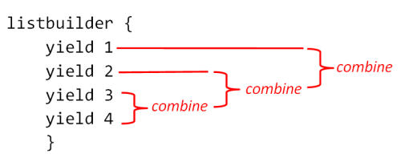

> In this post we're going to look at returning multiple values from a computation expression using the `Combine` method.

В этом посте мы собираемся рассмотерть возврат нескольких значений из вычислительного выражения с помощью метода `Combine`.

> 
> Note that the "builder" in the context of a computation expression is not the same as the OO "builder pattern" for constructing and validating objects.
> There is a post on the ["builder pattern" here](../builder-pattern).
> 


Обратите внимание, что "строитель" в контексте вычислительных выражений — это не то же самое, что объектно-ориентированный паттерн "строитель", который исползуется для конструирования и валидации объектов.


> ## The story so far...

## Как всё выглядит на данный момент...

> So far, our expression builder class looks like this:

На данный момент, наш класс-строитель выражений выглядит так:

```fsharp
type TraceBuilder() =
    member this.Bind(m, f) =
        match m with
        | None ->
            printfn "Bind с None. Выход."
        | Some a ->
            printfn "Bind с Some(%A). Продолжение." a
        Option.bind f m

    member this.Return(x) =
        printfn "Return с незавёрнутым %A" x
        Some x

    member this.ReturnFrom(m) =
        printfn "Return с завёрнутым (%A)" m
        m

    member this.Zero() =
        printfn "Zero"
        None

    member this.Yield(x) =
        printfn "Yield с незавёрутым %A" x
        Some x

    member this.YieldFrom(m) =
        printfn "Yield с завёрнутым (%A)" m
        m

// создаём экземпляр процесса
let trace = new TraceBuilder()
```

> And this class has worked fine so far.
> But we are about to run into a problem...

И на данный момент этот класс прекрасно работал.
Но мы вот-вот столкнёмся с проблемой...

> ## A problem with two 'yields'

## Проблема с двумя 'yields'

> Previously, we saw how `yield` could be used to return values just like `return`.

Ранее, мы видели, как `yield` может быть использован для возврата значений точно также, как и `return`.

> Normally, `yield` is not used just once, of course, but multiple times in order to return values at different stages of a process such as an enumeration.
> So let's try that:

Обычно, `yield` используется, конечно, не один раз, а несколько раз, чтобы возвращать значения на разных этапах такого процесса, как перечисление.
Так что давайте попробуем:

```fsharp
trace {
    yield 1
    yield 2
    } |> printfn "Результат yield и следующего за ним yield: %A"
```

> But uh-oh, we get an error message:

Но, беда, мы получаем сообщение об ошибке:

> ```text
> This control construct may only be used if the computation expression builder defines a 'Combine' method.
> ```

```text
Конструкция данного элемента управления может использоваться только в том случае, если построитель вычислительного выражения определяет метод "Combine"
```

> And if you use `return` instead of `yield`, you get the same error.

И если вы используете `return` вместо `yield`, вы получите ту же самую ошибку.

```fsharp
trace {
    return 1
    return 2
    } |> printfn "Результат return и следующего за ним return: %A"
```

> And this problem occurs in other contexts too.
> For example, if we want to do something and then return, like this:

И эта пробелма возникает также и в других контекстах.
Например, если мы хотим сделать что-то и затем вернуть результат, как здесь:

```fsharp
trace {
    if true then printfn "привет"
    return 1
    } |> printfn "Результат if и следующего за ним return: %A"
```

> We get the same error message about a missing 'Combine' method.

Мы получаем ту же самую ошибку про отсутствующий метод 'Combine'.

> ## Understanding the problem

## Понимание проблемы

> So what's going on here?

Так что же здесь происходит?

> To understand, let's go back to the behind-the-scenes view of the computation expression.
> We have seen that `return` and `yield` are really just the last step in a series of continuations, like this:

Чтобы разобраться, давайте вернёмся к исследования закулисной жизни вычислительного выражения.
Мы видели, что `return` и `yield` — в действительности всего лишь последний шаг в серии продолжений, как здесь:

```fsharp
Bind(1,fun x ->
   Bind(2,fun y ->
     Bind(x + y,fun z ->
        Return(z)  // или Yield
```

> You can think of `return` (or `yield`) as "resetting" the indentation, if you like.
> So when we `return/yield` and then `return/yield` again, we are generating code like this:

Вы можете думать про `return` (или `yield`), как про "сброс" отступов, если вам нравится.
Так что, когда мы выполняем `return/yield` и затем снова `return/yield`, мы генерируем код такого рода:

```fsharp
Bind(1,fun x ->
   Bind(2,fun y ->
     Bind(x + y,fun z ->
        Yield(z)
// начинаем новое выражение
Bind(3,fun w ->
   Bind(4,fun u ->
     Bind(w + u,fun v ->
        Yield(v)
```

> But really this can be simplified to:

Но в действительности он может быть упрощён до:

```fsharp
let value1 = какое-то выражение
let value2 = какое-то другое выражение
```

> In other words, we now have *two* values in our computation expression.
> And then the obvious question is, how should these two values be combined to give a single result for the computation expression as a whole?

Другими словами, сейчас мы имеем *два* значения в нашем вычислительном выражении.
И теперь возникает очевидный вопрос: как нам объединить эти два значения, чтобы получить <!-- общий --> единый результат для вычислительного выражения целиком?

> This is a very important point. **Return and yield do *not* generate an early return from a computation expression**.
> No, the entire computation expression, all the way to the last curly brace, is *always* evaluated and results in a *single* value.
> Let me repeat that.
> Every part of the computation expression is *always evaluated* -- there is no short circuiting going on.
> If we want to short circuit and return early, we have to write our own code to do that (and we'll see how to do that later).

Это очень важный момент. **Return и yield *не* выполняют ранний выход из вычислительного выражения**.
Нет, всё вычислительное выражение, вплоть до закрывающей фигурной скобки, *всегда* вычисляется и возвращается, как единственное значение.
Позвольте мне повторить.
Каждая часть вычислительного выражения *вычисляется в любом случае* — не существует короткоко пути <!-- буквально: короткого замыкания -->.
Если мы хотим короткого пути и раннего выхода, мы должны написать наш собственный код (и позже мы увидим, как это сделать).

> So, back to the pressing question.
> We have two expressions resulting in two values: how should those multiple values be combined into one?

Но вернёмя к насущному вопросу.
У нас есть результаты двух выражений в двух значениях: как следуюет объединить эти множественные значения в одно?

> ## Introducing "Combine"

## Введение в "Combine"

> The answer is by using the `Combine` method, which takes two *wrapped* values and combines them to make another wrapped value.
> Exactly how this works is up to us.

Ответ в использовании метода `Combine`, который получает два *завёрнутых" значения и объединяет <!-- комбинирует -->, чтобы создать новое завёрнутое значение.
Как именно это работает, зависит от нас.

> In our case, we are dealing specifically with `int options`, so one simple implementation that leaps to mind it just to add the numbers together.
> Each parameter is an `option` of course (the wrapped type), so we need to pick them apart and handle the four possible cases:

В нашем случае, мы имеем дело именно с `int options`, так что одна простая реализация, которая приходит в голову, это сложить числа.
Каждый параметр, это, конечно, `option` (завёрнутый тип), так что мы должны разделить их и обработать четыре возможных варианта:

```fsharp
type TraceBuilder() =
    // другие члены, как раньше

    member this.Combine (a,b) =
        match a,b with
        | Some a', Some b' ->
            printfn "Combine %A с %A" a' b'
            Some (a' + b')
        | Some a', None ->
            printfn "Combine %A с None" a'
            Some a'
        | None, Some b' ->
            printfn "Combine None с %A" b'
            Some b'
        | None, None ->
            printfn "Combine None с None"
            None

// создаём новый экземпляр
let trace = new TraceBuilder()
```

> Running the test code again:

Снова запускаем тестовый код:

```fsharp
trace {
    yield 1
    yield 2
    } |> printfn "Результат yield и следующего за ним yield: %A"
```

> But now we get a different error message:

Но теперь мы получаем другое сообщение об ошибке:

> ```text
> This control construct may only be used if the computation expression builder defines a 'Delay' method
> ```

```text
Конструкция данного элемента управления может использоваться только в том случае, если построитель вычислительного выражения определяет метод "Delay"
```

> The `Delay` method is a hook that allows you to delay evaluation of a computation expression until needed -- we'll discuss this in detail very soon; but for now, let's create a default implementation:

Метод `Delay` — это хук <!-- специальное решение -->, который позволяет отложить вычисление вычислительного выражения до тех пор, пока оно не понадобится — очень скоро мы обсудим его детально; но сейчас давайте создадим реализацию по-умолчанию:

```fsharp
type TraceBuilder() =
    // другие члены как раньше

    member this.Delay(f) =
        printfn "Delay"
        f()

// создаём новый экземпляр
let trace = new TraceBuilder()
```

> Running the test code again:

Снова запустим тестовый код:

```fsharp
trace {
    yield 1
    yield 2
    } |> printfn "Результат yield и следующего за ним yield: %A"
```

> And finally we get the code to complete.

И в конце концов мы получили завершённый код.

> ```text
> Delay
> Yield an unwrapped 1 as an option
> Delay
> Yield an unwrapped 2 as an option
> combining 1 and 2
> Result for yield then yield: Some 3
> ```

```text
Delay
Yield с незавёрнутым 1
Delay
Yield с незавёрнутым 2
Combine 1 с 2
Результат yield и следующего за ним yield: Some 3
```

> The result of the entire workflow is the sum of all the yields, namely `Some 3`.

Результат всего процесса — это сумма всех конструкций yield, то есть `Some 3`.

> If we have a "failure" in the workflow (e.g. a `None`), the second yield doesn't occur and the overall result is `Some 1` instead.

Если в вашем процессе возникет "неудача" (т.е. `None`), следующий yield не возникает и весь результат вместо этого будет равен `Some 1`.

```fsharp
trace {
    yield 1
    let! x = None
    yield 2
    } |> printfn "Результат yield и следующего за ним None: %A"
```

> We can have three `yields` rather than two:

У нас может быть три `yield` вместо двух:

```fsharp
trace {
    yield 1
    yield 2
    yield 3
    } |> printfn "Результат тройного yield: %A"
```

> The result is what you would expect, `Some 6`.

Результат такой, как вы могли бы ожидать, `Some 6`.

> We can even try mixing up `yield` and `return` together.
> Other than the syntax difference, the overall effect is the same.

Мы можем даже попытаться смешивать `yield` и `return` вместе.

```fsharp
trace {
    yield 1
    return 2
    } |> printfn "Результ yield и следующего за ним return: %A"

trace {
    return 1
    return 2
    } |> printfn "Результат return и следующего за ним return: %A"
```

> ## Using Combine for sequence generation

## Использование Combine для генерации последовательности

> Adding numbers up is not really the point of `yield`, although you might perhaps use a similar idea for constructing concatenated strings, somewhat like `StringBuilder`.

Сложение числе — не настоящая цель `yield`, хотя вы можете возможно исопльзовать похожую идею для конструирования конкатениваных строк, что-то наподобии `StringBuilder`.

> No, `yield` is naturally used as part of sequence generation, and now that we understand `Combine`, we can extend our "ListBuilder" workflow (from last time) with the required methods.
Нет, `yield` естественным образом используется как часть генерации последовательности, и теперь, когда мы понимаем <!-- как работает --> `Combine`, мы можем расширить наш процесс "ListBuilder" (из предыдущего раза) нужными методами.

> * The `Combine` method is just list concatenation.
> * The `Delay` method can use a default implementation for now.

* Метод `Combine` всего лишь конкатенирует списки.
* Метод `Delay` всё ещё может использовать реализацию по-умолчанию.

> Here's the full class:

Вот класс целиком:

```fsharp
type ListBuilder() =
    member this.Bind(m, f) =
        m |> List.collect f

    member this.Zero() =
        printfn "Zero"
        []

    member this.Yield(x) =
        printfn "Yield незавёрнутого %A в виде списка" x
        [x]

    member this.YieldFrom(m) =
        printfn "Yield завёрнутого (%A) непосредственно" m
        m

    member this.For(m,f) =
        printfn "For %A" m
        this.Bind(m,f)

    member this.Combine (a,b) =
        printfn "Combine %A и %A" a b
        List.concat [a;b]

    member this.Delay(f) =
        printfn "Delay"
        f()

// создаём экземпляр процесса
let listbuilder = new ListBuilder()
```

> And here it is in use:

И вот его использование:

```fsharp
listbuilder {
    yield 1
    yield 2
    } |> printfn "Результат yield и следующего за ним yield: %A"

listbuilder {
    yield 1
    yield! [2;3]
    } |> printfn "Результат yield и следующего за ним yield! : %A"
```

> And here's a more complicated example with a `for` loop and some `yield`s.

А вот более сложный пример с циклом `for` и несколькими `yield`.

```fsharp
listbuilder {
    for i in ["красная";"синяя"] do
        yield i
        for j in ["шапка";"повязка"] do
            yield! [i + " " + j;"-"]
    } |> printfn "Результат for..in..do : %A"
```

> And the result is:

И результат:

> ```text
> ["red"; "red hat"; "-"; "red tie"; "-"; "blue"; "blue hat"; "-"; "blue tie"; "-"]
> ```

```text
["красная"; "красная шапка"; "-"; "красная повязка"; "-"; "синяя"; "синяя шапка"; "-"; "синяя повязка"; "-"]
```

> You can see that by combining `for..in..do` with `yield`, we are not too far away from the built-in `seq` expression syntax (except that `seq` is lazy, of course).

Вы можете видеть, что комбинируя `for..in..do` с `yield`, мы не слишком далеко ушли от встроенного синтаксиса выражений `seq` (за исключением того `seq` это ленивое построение последовательности, конечно).

> I would strongly encourage you to play around with this a bit until you are clear on what is going on behind the scenes.
> As you can see from the example above, you can use `yield` in creative ways to generate all sorts of irregular lists, not just simple ones.

Я настойчиво предлагаю вам поиграться с этим немного, пока вы не начнёте ясно понимать, что в данном случае происходит за кулисами.
Как вы можете видеть из примера выше, вы можете использовать `yield` творческими способами для геренации всех видов нерегулярных списков, а не только самых простых.

> *Note: If you're wondering about `While`, we're going to hold off on it for a bit, until after we have looked at `Delay` in an upcoming post*.

*Замечание: Если вам интересно, что насчёт `While`, собираемся немного отложить объяснение этого аспекта до тех пор, пока неразберёмся с `Delay` в следующем посте*.

> ## Order of processing for "combine"

Порядок обработки <!-- вызовов --> "combine"

> The `Combine` method only has two parameters.
> So what happens when you combine more than two values?
> For example, here are four values to combine:

У метода `Combine` всего два параметра.
Что происходит, когда вы комбинируете больше, чем два значения?
Например, вот четыре значения для комбинирования:

```fsharp
listbuilder {
    yield 1
    yield 2
    yield 3
    yield 4
    } |> printfn "Результат четырёх yield: %A"
```

> If you look at the output you can see that the values are combined pair-wise, as you might expect.

Если вы посмотрите в вывод программы, вы увидите, что значения скомбинированы попарно, как вы могли и ожидать.

> ```text
> combining [3] and [4]
> combining [2] and [3; 4]
> combining [1] and [2; 3; 4]
> Result for yield x 4: [1; 2; 3; 4]
> ```

> A subtle but important point is that they are combined "backwards", starting from the last value.
> First "3" is combined with "4", and the result of that is then combined with "2", and so on.

Тонкий, но важный момент заключается в том, что они комбинируется "в обратном порядке", начиная с последнего занчения.
Сначала "3" комбинируется с "4", затем результат комбинируется с "2", и так далее.



> ## Combine for non-sequences

## Комбинирование не для последовательностей

> In the second of our earlier problematic examples, we didn't have a sequence; we just had two separate expressions in a row.

Во втором из наших ранних примеров проблем, у нас не было последовательности; у нас было всего лишь два отдельных выражения подряд.

```fsharp
trace {
    if true then printfn "привет"  // выражение 1
    return 1                       // выражение 2
    } |> printfn "Результат комбинирования: %A"
```

> How should these expressions be combined?

Как должны быть скомбинированы эти выражения?

> There are a number of common ways of doing this, depending on the concepts that the workflow supports.

Есть несколько способов сделать это, в зависимости от концепций, которые поддерживает процесс.

> ### Implementing combine for workflows with "success" or "failure"

### Реализация комбинирования для процессов с "удачей" и "неудачей"

> If the workflow has some concept of "success" or "failure", then a standard approach is:

Если процесс имеет концепцие, похожие на "удачу" и "неудачу", тогда стандартный подход:

> * If the first expression "succeeds" (whatever that means in context), then use that value.
> * Otherwise use the value of the second expression.

* Если первое выражение "успешно" (что бы это ни значило в контексте), тогда использовать это значение.
* В противном случае использовать значение второго выражения.

> In this case, we also generally use the "failure" value for `Zero`.

В этом случае мы также обычно используем значение "неудача" для `Zero`.

> This approach is useful for chaining together a series of "or else" expressions where the first success "wins" and becomes the overall result.

Этот подход полезен для объединения в цепочку серии выражений "или иначе", где первый успех "побеждает" и становится результатом всего выражения.

> ```text
> if (do first expression)
> or else (do second expression)
> or else (do third expression)
> ```

```text
если (первое выражение)
или иначе (второе выражение)
или иначе (третье выражение)
```

> For example, for the `maybe` workflow, it is common to return the first expression if it is `Some`, but otherwise the second expression, like this:

Например, для процесса `maybe` общей практикой является возврат первого выражение, если у него есть результат, в противом случае — второго, как здесь:

```fsharp
type TraceBuilder() =
    // другие члены как раньше

    member this.Zero() =
        printfn "Zero"
        None  // неудача

    member this.Combine (a,b) =
        printfn "Combine %A и %A" a b
        match a with
        | Some _ -> a  // успех — берём значение a
        | None -> b    // неудача — вместо этого берём значение b

// создаём новый экземпляр
let trace = new TraceBuilder()
```

> **Example: Parsing**

**Пример: Разбор**

> Let's try a parsing example with this implementation:

Давайте испытаем пример разбора с такими ограничениями:

```fsharp
type IntOrBool = I of int | B of bool

let parseInt s =
    match System.Int32.TryParse(s) with
    | true,i -> Some (I i)
    | false,_ -> None

let parseBool s =
    match System.Boolean.TryParse(s) with
    | true,i -> Some (B i)
    | false,_ -> None

trace {
    return! parseBool "42"  // неудача
    return! parseInt "42"
    } |> printfn "Результат разбора: %A"
```

> We get the following result:

Вы получаем следующий результат:

> ```text
> Some (I 42)
> ```

```text
Some (I 42)
```

> You can see that the first `return!` expression is `None`, and ignored.
> So the overall result is the second expression, `Some (I 42)`.

Вы можете видеть, что результат первого `return!` равен `None` и игнорируется.
Так что конечный результат это результат второго выражения `Some (I 42)`.

> **Example: Dictionary lookup**

**Пример: Поиск в словаре**

> In this example, we'll try looking up the same key in a number of dictionaries, and return when we find a value:

В этом примере, мы попытаемся найти один и тот же ключ в нескольких словарях и возвратим значение, когда его найдём:

```fsharp
let map1 = [ ("1","Один"); ("2","Два") ] |> Map.ofList
let map2 = [ ("A","Аня"); ("B","Вова") ] |> Map.ofList

trace {
    return! map1.TryFind "A"
    return! map2.TryFind "A"
    } |> printfn "Результат поиска в словаре: %A"
```

> We get the following result:

Мы получим такой результат:

> ```text
> Result for map lookup: Some "Alice"
> ```

```text
Результат поиска в словаре: "Аня"
```

> You can see that the first lookup is `None`, and ignored.
> So the overall result is the second lookup.

Вы можете видеть, что первый поиск возвращает `None` и игнорируется.
Так что результат всего процесса берётся из второго поиска.

> As you can see, this technique is very convenient when doing parsing or evaluating a sequence of (possibly unsuccessful) operations.

Как вы можете видеть, эта техника очень удобна, когда вы делаете разбор или вычисление последоватльности (возможно неудачных) операций.

> ### Implementing combine for workflows with sequential steps

### Реализация комбинирования для процессов с последовательными шагами

> If the workflow has the concept of sequential steps, then the overall result is just the value of the last step, and all the previous steps are evaluated only for their side effects.

Если процесс имеет концепцию последовальных шагов, тогда результат всего процесса это значение последнего шага, а все предыдущие шаги выполняются только из-за их побочных эффектов.

> In normal F#, this would be written:

В обычном F# мы могли бы написать:

> ```text
> do some expression
> do some other expression
> final expression
> ```


```text
выполнить какое-то выражение
выполнить какое-то другое выражение
финальное выражение
```

> Or using the semicolon syntax, just:

Или, используя синтаксис с точкой-с-заятой, просто:

> ```text
> some expression; some other expression; final expression
> ```

```text
выполнить какое-то выражение, выполнить какое-то другое выражение, финальное выражение
```

> In normal F#, each expression (other than the last) evaluates to the unit value.

В обычном F#, каждое выражение (кроме последнего) вычисляется в значение типа `unit`.

> The equivalent approach for a computation expression is to treat each expression (other than the last) as a *wrapped* unit value, and "pass it into" the next expression, and so on, until you reach the last expression.

Эквивалентным подходом в вычислительных выражениях была бы трактовка каждого выражения (кроме последнего) как "завёрнутого" значения `unit` с передачей его в следующее выражение, и так до конца, пока вы не достигнете последнего выражения.

> This is exactly what bind does, of course, and so the easiest implementation is just to reuse the `Bind` method itself.
> Also, for this approach to work it is important that `Zero` is the wrapped unit value.

Это именно то, что делает связыание, конечно, и поэтому простейшая реалиация — просто переиспользовать метод `Bind`.
Также, чтобы этот подход работал, важно, чтобы `Zero` возвращал завёрнутое значение `unit`.

```fsharp
type TraceBuilder() =
    // другие члены как раньше

    member this.Zero() =
        printfn "Zero"
        this.Return ()  // unit — это не None

    member this.Combine (a,b) =
        printfn "Combine %A и %A" a b
        this.Bind( a, fun ()-> b )

// создаём новый экземпляр
let trace = new TraceBuilder()
```

> The difference from a normal bind is that the continuation has a unit parameter, and evaluates to `b`.
> This in turn forces `a` to be of type `WrapperType<unit>` in general, or `unit option` in our case.

Отличие нормального связывния в том, что продолжение имеет параметр типа `unit` и вычисляет `b`.
Это, в свою очередь, заставляет `a` иметь в общем тип `ТипОбёртка<unit>`, или, в нашем случае `unit option`.

> Here's an example of sequential processing that works with this implementation of `Combine`:

Вот пример последовательной обработки, котоарая работает с такой реализацией `Combine`:

```fsharp
trace {
    if true then printfn "привет......."
    if false then printfn ".......мир"
    return 1
    } |> printfn "Результат последовательного комбинирования: %A"
```

> Here's the following trace.
> Note that the result of the whole expression was the result of the last expression in the sequence, just like normal F# code.

 Вот последующая трассировка.
 Обратие внимание, что результат всего выражения оказался результатом последнего выражения в последовательности, как и в обычном коде F#.

> ```text
> hello.......
> Zero
> Returning a unwrapped <null> as an option
> Zero
> Returning a unwrapped <null> as an option
> Returning a unwrapped 1 as an option
> Combining Some null with Some 1
> Combining Some null with Some 1
> Result for sequential combine: Some 1
> ```

```text
привет.......
Zero
Return с незавёрнутым <null>
Zero
Return с незавёрнутым <null>
Return с незавёрнутым 1
Combine Some null и Some 1
Combine Some null и Some 1
Результат последовательного комбинирования: Some 1
```

> ### Implementing combine for workflows that build data structures

### Реализация комбинирования для процессов, которые строят структуры данных

> Finally, another common pattern for workflows is that they build data structures.
> In this case, `Combine` should merge the two data structures in whatever way is appropriate.
> And the `Zero` method should create an empty data structure, if needed (and if even possible).

Наконец, ещё один общий паттерн для процессов — применение их, чтобы строить структуры данных.
В этом случае `Combine` должен сливать две структуры данных любым подходящим способом.
А метод `Zero` должен создавать постую структуру данных, если нужно (и если вообще возможно).

> In the "list builder" example above, we used exactly this approach.
> `Combine` was just list concatenation and `Zero` was the empty list.

В примере выше со "строителем списка" мы использовали точно этот подход.

> ## Guidelines for mixing "Combine" and "Zero"

## Рекомендации по смешиванию "Combine" и "Zero"

> We have looked at two different implementations for `Combine` for option types.

Мы видели две различаются реализации `Combine` для опциональных типов.

> * The first one used options as "success/failure" indicators, when the first success "won"
>   In this case `Zero` was defined as `None`
> * The second one was sequential,
>   In this case `Zero` was defined as `Some ()`

* Первая использовала оциональные значения для индикации "успеха/неудачи", когда первый успех "побеждлает".
  В этом случае `Zero` определялся как `None`.
* Во втором случае речь шла о последовательности.
  В этом случае `Zero` определялся как `Some ()`.

> Both cases worked nicely, but was that luck, or are there are any guidelines for implementing `Combine` and `Zero` correctly?

Оба варианта прекрасно работают, но было ли это удачей или есть какие-то рекоммендации для корректной реализации `Combine` и `Zero`?

> First, note that `Combine` does *not* have to give the same result if the parameters are swapped.
> That is, `Combine(a,b)` need not be the same as `Combine(b,a)`.
> The list builder is a good example of this.

Во-первых, обратине внимание, что `Combine` *не* обязан давать тот же результат, если поменять параметры местами.
То есть `Combine(a,b)` не обязательно имеет то же значение, что и `Combine(b,a)`.
Строитель списков — хороший пример этого.

> On the other hand there is a useful rule that connects `Zero` and `Combine`.
С другой стороны, есть полезное правило, которое связывает `Zero` и `Combine`.

> **Rule: `Combine(a,Zero)` should be the same as `Combine(Zero,a)` which should the same as just `a`.**

**Правило: `Combine(a,Zero)` должно быть равно `Combine(Zero,a)`, которое в свою очередь должно быть равно просто `a`.**

> To use an analogy from arithmetic, you can think of `Combine` like addition (which is not a bad analogy -- it really is "adding" two values).
> And `Zero` is just the number zero, of course!
So the rule above can be expressed as:

Используя аналогию из арифметики, вы можете думать о `Combine`, как о сложении (что не является плохой аналогией — поскольку оно действительно "складывает" два значения).
И `Zero` в этом случае — число ноль, конечно!
Так что правило выше, может быть выражено, как:

> **Rule: `a + 0` is the same as `0 + a` is the same as just `a`, where `+` means `Combine` and `0` means `Zero`.**

**Правило: `a + 0` — то же самое, что и `0 + a`, и то же самое, что и `a`, где `+` означает `Combine`, а `0` означает `Zero`.**

> If you look at the first `Combine` implementation ("success/failure") for option types, you'll see that it does indeed comply with this rule, as does the second implementation ("bind" with `Some()`).

Если вы посмотрите на первую реализацию `Combine` ("успех/неудача") для опциональных типов, вы увидите, что она действительно соответсвует этому правилу, точно также, как и вторая реализация ("связывание" с `Some()`).

> On the other hand, if we had used the "bind" implementation of `Combine` but left `Zero` defined as `None`, it would *not* have obeyed the addition rule, which would be a clue that we had got something wrong.

С другой стороны, если бы мы использовали вторую реализацию `Combine`, но оставили бы `Zero`, определённый как `None`, это бы *не* подчинялось правилу сложения, что означало бы, что мы сделали что-то не так.

> ## "Combine" without bind

## "Сombine" без связывания

> As with all the builder methods, if you don't need them, you don't need to implement them.
> So for a workflow that is strongly sequential, you could easily create a builder class with `Combine`, `Zero`, and `Yield`, say, without having to implement `Bind` and `Return` at all.

Как и в случае с другими методами, если вам они не нужны, вы не обязаны их реализовывать.
Так, для процесса, который является строгим последовательным, вы можете легко создать класс-строитель со, скажем, `Combine`, `Zero` и `Yield`, вообще без реализации `Bind` и `Return`.

> Here's an example of a minimal implementation that works:

Вот пример минимальной реализации, которая работает:

```fsharp
type TraceBuilder() =

    member this.ReturnFrom(x) = x

    member this.Zero() = Some ()

    member this.Combine (a,b) =
        a |> Option.bind (fun ()-> b )

    member this.Delay(f) = f()

// создаём экземпляр процесса
let trace = new TraceBuilder()
```

> And here it is in use:

А вот как он используется:

```fsharp
trace {
    if true then printfn "привет......."
    if false then printfn ".......мир"
    return! Some 1
    } |> printfn "Результат минимального комбинирования: %A"
```

> Similarly, if you have a data-structure oriented workflow, you could just implement `Combine` and some other helpers.
> For example, here is a minimal implementation of our list builder class:

Сходным образом, если у вас есть процесс, ориентированный на структуру-данных, вы могли бы просто реализовать `Combine` и некоторые подручные методы.
Например, вот минимальная реализация нашего класса-строителя для списков.

```fsharp
type ListBuilder() =

    member this.Yield(x) = [x]

    member this.For(m,f) =
        m |> List.collect f

    member this.Combine (a,b) =
        List.concat [a;b]

    member this.Delay(f) = f()

// создаём экземпляр процесса
let listbuilder = new ListBuilder()
```

> And even with the minimal implementation, we can write code like this:

И даже с минимальной реализацией, мы можем писать код наподобии этого:

```fsharp
listbuilder {
    yield 1
    yield 2
    } |> printfn "Результат: %A"

listbuilder {
    for i in [1..5] do yield i + 2
    yield 42
    } |> printfn "Результат: %A"
```

> ## A standalone "Combine" function

## Обособленная функция "Combine"

> In a previous post, we saw that the "bind" function is often used as standalone function, and is normally given the operator `>>=`.

В предыдущеем посте мы видели, что функция связывания часто используется самостоятельно и обычно её реализуют в виде оператора `>>=`.

> The `Combine` function too, is often used as a standalone function.
> Unlike bind, there is no standard symbol -- it can vary depending on how the combine function works.

Функция `Combine` тоже часто используется, как обособленная.
В отличие от `Bind`, у неё нет стандартного обератора, он может отличаться в зависимости от того, как функция комбинирования работает.

> A symmetric combination operation is often written as `++` or `<+>`.
> And the "left-biased" combination (that is, only do the second expression if the first one fails) that we used earlier for options is sometimes written as `<++`.

Симметричные операции комбинирования часто записываются как `++` или `<+>`.
"Лево-сторонняя" комбинация (которая вычисляет второе выражение, только если первое завершилось неудачей), которое мы ранее использовали для опционального типы иногда записывается как `<++`.

> So here is an example of a standalone left-biased combination of options, as used in a dictionary lookup example.

Вот пример обособленной лево-сторонней комбинации опциональных значений, какой использовался в примере с поиском в словаре.

```fsharp
module StandaloneCombine =

    let combine a b =
        match a with
        | Some _ -> a  // успех — используем a
        | None -> b    // неудача — вместо a используем b

    // создаём инфиксную версию
    let ( <++ ) = combine

    let map1 = [ ("1","Один"); ("2","Два") ] |> Map.ofList
    let map2 = [ ("A","Аня"); ("B","Вова") ] |> Map.ofList

    let result =
        (map1.TryFind "A")
        <++ (map1.TryFind "B")
        <++ (map2.TryFind "A")
        <++ (map2.TryFind "B")
        |> printfn "Результат комбинирования опциональных значений: %A"
```

> ## Summary

## Заключение

> What have we learned about `Combine` in this post?

Что мы узнали о `Combine` в этом посте?

> * You need to implement `Combine` (and `Delay`) if you need to combine or "add" more than one wrapped value in a computation expression.
> * `Combine` combines values pairwise, from last to first.
> * There is no universal implementation of `Combine` that works in all cases -- it needs to be customized according the particular needs of the workflow.
> * There is a sensible rule that relates `Combine` with `Zero`.
> * `Combine` doesn't require `Bind` to be implemented.
> * `Combine` can be exposed as a standalone function

* Вы должны реализовать `Combine` (и `Delay`) если вам нужно комбинировать или "складывать" больше чем одно завёрнутое значение в вычислительных выражениях.
* `Combine` комбинирует значения попарно, от последнего к первому.
* Нет универсальной реализации `Combine`, которая работает во всех случаях — её необходимо подогнать в соответсвии с особенностями процесса.
* Есть осмысленное рпавило, которое связывает `Combine` с `Zero`.
* `Combine` не требует, чтобы метод `Bind` был реализован.
* `Combine` можно использовать как обособленную функцию <!-- без других методов -->

> In the next post, we'll add logic to control exactly when the internal expressions get evaluated, and introduce true short circuiting and lazy evaluation.

В следующем посте мы добавим логику для управления временем вычисления выражений и коротко расскажем о ленивых вычислениях.
