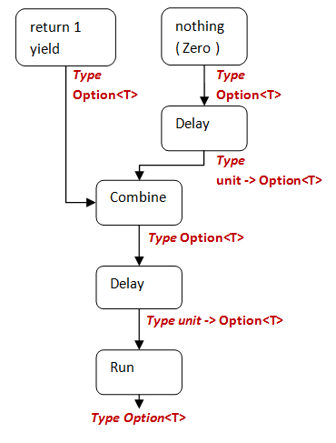
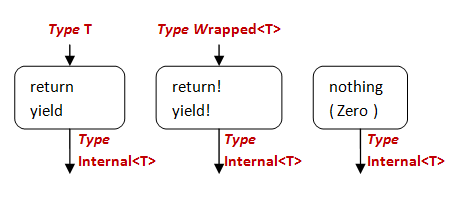

В последних постах мы разобрали основные методы (`Bind`, `Return`, `Zero` и `Combine`), нужные для создания собственного построителя вычислительных выражений.
В этом посте мы исследуем дополнительные возможности, которые позволяют ускорить процесс, управляя временем вычисления выражений.


Обратите внимание, что "построитель" в контексте вычислительного выражения — это не то же самое, что и объектно-ориентированный "паттерн строитель" , нужный для конструирования и валидации объектов.


## Проблема: избавляемся от ненужных вычислений

Вернёмся к исследованию процесса `maybe`, с котором мы уже неоднократно сталкивались.
Можно ли с помощью ключевого слова "return" прервать вычисления и вернуть результат, не вычисляя остаток выражения?

Вот полный текст нашего класс-построителя.
Ключевой метод, на который следует обратить внимание, это `Combine`.
Он возвращает первое выражение и игнорирует второе.

```fsharp
type TraceBuilder() =
    member this.Bind(m, f) =
        match m with
        | None ->
            printfn "Bind с None. Выход."
        | Some a ->
            printfn "Bind с Some(%A). Продолжение" a
        Option.bind f m

    member this.Return(x) =
        printfn "Return незавёрнутого %A как Option" x
        Some x

    member this.Zero() =
        printfn "Zero"
        None

    member this.Combine (a,b) =
        printfn "Combine. Сразу возвращаем %A. Игнорируем  %A" a b
        a

    member this.Delay(f) =
        printfn "Delay"
        f()

// создаём экземпляр процесса
let trace = new TraceBuilder()
```

Посмотрим на его работу, напечатав что-то одно, вызвав "return" и затем напечатав что-то другое:

```fsharp
trace {
    printfn "Часть 1: до return 1"
    return 1
    printfn "Часть 2: после return"
    } |> printfn "Результат Части 1 без Части 2: %A"
```

Отладочный вывод (который я прокомментировал) будет выглядеть так:

```text
// первое выражение, перед "return"
Delay
Часть 1: до 1
Return незавёрнутого 1 как Option

// второе выражение, перед закрывающей фигурной скобкой.
Delay
Часть 2: после return
Zero   // здесь zero, потому что нет явного return для этой части

// комбинируем два выражения
Combine. Сразу возвращаем Some 1. Игнорируем <null>

// финальный результат
Результат Части 1 без Части 2: Some 1
```

А вот и проблема.
Строка "Часть 2: после return" была напечатана, не смотря на то, что мы хотели прервать вычисления. 

Почему?
Я уже писал в предыдущем посте, что **return и yield *не* выполняют ранний выход из вычислительного выражения**.
Всё вычислительное выражение, вплоть до закрывающей фигурной скобки, *всегда* вычисляется и возвращает единственный результат.

И, если вам не нужны побочные эффекты (такие, как печать сообщений) или у вас ресурсоёмкий код, то это проблема.

Как же избежать вычисления второй части, пока она нам действительно не понадобиться?

## Введение в "Delay"

На этот вопрос есть достаточно простой ответ — поместите вторую часть выражения в функцию и вызывайте её только тогда, когда вам нужен результат вычисиления:

```fsharp
let part2 =
    fun () ->
        printfn "Часть 2: после return"
        // выполняем какие-то действия
        // возвращаем Zero

// вычисляем, только если нужно
if needed then
   let result = part2()
```

Благодая этой технике, код вычисления части 2 вычислительного выражения выполняется полностью, но из-за того, что что он возвращает функцию, пока функция не вызвана, ничего и *не происходит*.
Однако метод `Combine` никогда её не вызовет, так что код второй части вообще никогда не выполнится.

Это в точности то, для чего нужен метод `Delay`.
Любой результат из `Return` или `Yield` помещается в "отложенную" функцию, и вы выбираете, запускать её или не запускать.

Перепишем построитель так, чтобы реализовать отложенные вычисления:

```fsharp
type TraceBuilder() =
    // другие члены как раньше

    member this.Delay(funcToDelay) =
        let delayed = fun () ->
            printfn "%A - Начало отложенной функции." funcToDelay
            let delayedResult = funcToDelay()
            printfn "%A - Конец отложенной функции. Результат %A" funcToDelay delayedResult
            delayedResult  // возвращаем результат

        printfn "%A - отложена благодаря %A" funcToDelay delayed
        delayed // возвращаем новую функцию
```

Как видите, `Delay` в качестве параметра принимает функцию для выполнения.
Раньше мы немедленно её вызывали.
Сейчас мы помещаем эту функцию в другую функцию и возвращаем вторую вместо первой.
Я добавил несколько трассирующих операторов до и после оригинальной функции.

Возможно, вы заметили, что сигнатура метода `Delay` изменилась.
До изменения, она возвращала конкретное значение (в нашем случае Option), но сейчас она возвращает функцию.

```fsharp
// сигнатура ДО изменения
member Delay : f:(unit -> 'a) -> 'a

// сигнатура ПОСЛЕ изменения
member Delay : f:(unit -> 'b) -> (unit -> 'b)
```

Кстати, мы могли бы реализовать `Delay` гораздо проще, без всякой трассировки, просто возвращая ту же самую функцию, которую получили:

```fsharp
member this.Delay(f) =
    f
```

Гораздо короче!
Но сейчас нам всё-таки нужна трассировка.

Попробуем снова:

```fsharp
trace {
    printfn "Часть 1: перед return 1"
    return 1
    printfn "Часть 2: после return"
    } |> printfn "Результат Части 1 без Части 2: %A"
```

Ой-ой.
Теперь вообще ничего не напечатано!
Что же пошло не так?

Посмотрев на вывод, мы увидим:

```text
Результат Части 1 без Части 2: <fun:Delay@84-5>
```

Хммм.
Вывод всего выражения `trace` теперь *функция*, а не `Option`.
Мы отложили все наши вычисления, но "не вернули их в работу", на самом деле вызвав функцию!

Один из способов справиться с проблемой — самим вызвать функцию, полученную из вычислительного выражения.

```fsharp
let f = trace {
    printfn "Часть 1: до return 1"
    return 1
    printfn "Часть 2: после return"
    }
f() |> printfn "Результат Части 1 без Части 2: %A"
```

Этот способ работает, но нельзя ли то же самое делать автоматически?
Конечно, можно!

## Введение в "Run"

Именно для этого нужен метод `Run`.
Он вызывается на последнем шаге процесса вычисления и запускает отложенные вычисления.

Реализация:

```fsharp
type TraceBuilder() =
    // другие члены как и раньше

    member this.Run(funcToRun) =
        printfn "%A - Run Начало." funcToRun
        let runResult = funcToRun()
        printfn "%A - Run Конец. Результат %A" funcToRun runResult
        runResult // возвращаем результат выполнения отложенной функции
```

Попробуем ещё раз:

```fsharp
trace {
    printfn "Часть 1: до return 1"
    return 1
    printfn "Часть 2: после return"
    } |> printfn "Результат Части 1 без Части 2: %A"
```

И результат в точности такой, как мы хотели.
Первая часть выполняется, а вторая часть нет.
И при этом результат всего вычислительного выражения это `Option`, а не функция.

## Когда вызывается "Delay"?

Вызов `Delay` вставляется в определённые места процесса вычисления в соответствии с несколькими простыми правилами. Сейчас мы с ними разберёмся.

* Нижнее (самое вложенное) выражение всегда откладывается.
* Если оно комбинируется с предшествующим выражением, вывод `Combine` также откладывается.
* Повторяем, пока финальное отложенное вычисление не отправляется в `Run`.

Опираясь на эти правила, давайте разберёмся, что происходит в нашем примере.

* Первая часть выражения — это оператор печати плюс `return 1`.
* Вторая часть выражения — оператор печати без явного `return`, значит, здесь вызван метод `Zero()`.
* Значение `None`, полученное из `Zero`, отправляется в `Delay`, возвращая "отложенное значение" `Option`, то есть функцию, которая возвращает `Option`, если её вызывать.
* Опциональное значение из части 1 и отложенное значение из части 2 комбинирутся с помощью `Combine` и второе значение отбрасывается.
* Результат комбинации становится следующим "отложенным значением".
* В конце отложенное значение попадает в метод `Run`, который выполяет его и возвращает простое опцинальное значение.

Вот диаграмма, которая показывает этот процесс:



Посмотрев на трассирующий вывод из примера выше, мы в деталях увидим, что происходит.
Вывод многословный, поэтому я добавил объяснения.
Обратите внимание, что самые вложенные выражения идут в начале трассировки, но на диаграмме они нарисованы внизу. В трассировке вычисление строится сверху вниз, а на диаграмме снизу вверх.

```text
// откладываем вычисление всего выражения (результат Combine)
<fun:Pipe #1 input at line 42@43> - отложена благодаря <fun:delayed@23>

// запускаем самое внешнее отложенное выражение (полученное из Combine)
<fun:delayed@23> - Run Начало.
<fun:Pipe #1 input at line 42@43> - Начало отложенной функции.

// результат первого выражения Some(1)
Часть 1: до return 1
Return незавёрнутого 1 как Option

// второе выражение заворачивается в функцию
<fun:Pipe #1 input at line 42@45-1> - отложена благодаря <fun:delayed@23>

// первое и второе выражения комбинируется
Return ранний Some 1. Игнорируем вторую часть: <fun:delayed@23>

// завершено оборачивание всего выражения (результата Combine)
<fun:Pipe #1 input at line 42@43> - Конец отложенной функции. Результат Some 1
<fun:delayed@23> - Run Конец. Результат Some 1

// сейчас резульат Option, а не функция
Результат Части 1 без Части 2: Some 1
```

## "Delay" изменяет сигнатуру "Combine"

Реализация метода `Delay` оказывает эффект на сигнутуру `Combine`.

Ранее метод `Combine` обрабатывал параметры опционального типа.
Но сейчас он обрабатывает результат `Delay`, который является функцией.

Давайте явно запишем типы, которые ожидает `Combine`, то есть `int option`:

```fsharp
member this.Combine (a: int option,b: int option) =
    printfn "Combine. Сразу возвращаем %A. Игнорируем  %A" a b
    a
```

Теперь мы получаем ошибку при возврате выражения:

```fsharp
trace {
    printfn "Part 1: about to return 1"
    return 1
    printfn "Part 2: after return has happened"
    } |> printfn "Result for Part1 without Part2: %A"
```

Ошибка:

```text
Error FS0193 : Несоответствие ограничений типов. Тип 
    "unit -> 'a option"    
несовместим с типом
    "int option"
```

Другими словами, в `Combine` передаётся отложенная функция (`unit -> 'a`), которая не совпадает с нашей явной сигнатурой.

Как же быть, если мы *хотим* скомбинировать параметры, но они передаются как функции вместо обычных значений?

Ответ прост — чтобы получить отложенное значение, вызовите функцию, которая была передана в качестве параметра.

Продемонстрируем этот подход на примере сложения из предыдущего поста.

```fsharp
type TraceBuilder() =
    // другие члены как разнье

    member this.Combine (m,f) =
        printfn "Combine. Перед получением отложенного параметра %A" f
        let y = f()
        printfn "Combine. После получения отложенного параметра %A. Результат %A" f y

        match m,y with
        | Some a, Some b ->
            printfn "комбинируем %A с %A" a b
            Some (a + b)
        | Some a, None ->
            printfn "комбинируем %A с None" a
            Some a
        | None, Some b ->
            printfn "комбинируем None с %A" b
            Some b
        | None, None ->
            printfn "комбинируем None с None"
            None
```

В новой версии `Combine` *второй* параметр стал функцией, а не `int option`.
Так что, преджде чем комбинировать значения, мы должны сначала вызвать функцию.

Протестировав код:

```fsharp
trace {
    return 1
    return 2
    } |> printfn "Результ return с последующим return: %A"
```

Мы получим следующую (аннотированную) трассировку:

```text
// откладываем вычисление всего выражения
<fun:Pipe #1 input at line 70@71> - отложена благодаря <fun:delayed@46>

// вычисляем выражеие целиком
<fun:delayed@46> - Run Начало.                                         

// вызываем первую отложенную функцию
<fun:Pipe #1 input at line 70@71> - Начало отложенной функции.         

// первый возврат
Return незавёрнутого 1 как Option                                         

// откладываем вторую отложенную функцию
<fun:Pipe #1 input at line 70@72-1> - отложена благодаря <fun:delayed@46> 

// начинаем комбинирование
Combine. Перед получением отложенного параметра <fun:delayed@46>          

    // вызываем вторую отложенную функцию внутри Combine
    <fun:Pipe #1 input at line 70@72-1> - Начало отложенной функции.          
    Return незавёрнутого 2 как Option                                         
    <fun:Pipe #1 input at line 70@72-1> - Конец отложенной функции. Результат Some 2
    // получили второй результат

Combine. После получения отложенного параметра <fun:delayed@46>. Результат Some 2
комбинируем 1 с 2                                                             
// комбинирование завершено

<fun:Pipe #1 input at line 70@71> - Конец отложенной функции. Результат Some 3
// комбинирование отложенного выражение завершено

<fun:delayed@46> - Run Конец. Результат Some 3   
// выполнение завершено

// печатаем результат
Результ return с последующим return: Some 3   
```

## Понимание ограничений типов

До сих пор в реализации нашего построителя мы использовали только типы-обёртки (такие как `int option`) и их отложенные версии (`unit -> int option`).

На самом деле мы можем использовать любые типы, удовлетворяющие определённым ограничениям.
Знание, какие ограничения типов существуют в вычислительном выражении, помогает прояснить, как всё друг с другом согласуется.

Например, мы видели, что

* Вывод `Return` передаётся в `Delay`, поэтому они должны иметь совместимые типы.
* Вывод `Delay` передаётся во второй параметр `Combine`.
* Вывод `Delay` передаётся в `Run`.

> But the output of `Return` does *not* have to be our "public" wrapped type.
> It could be an internally defined type instead.

Но вывод `Return` не обязан быть нашим "публичным" типом-обёрткой.
Вместо этого он может быть каким-то внутренним типом.



Точно также, отложенный тип не обязан быть простой функцией, он может быть любым типом, удовлетворяющим огранчениям.

Возьмём простой набор возвращаемых выражений:

```fsharp
    trace {
        return 1
        return 2
        return 3
        } |> printfn "Результат трёх операторов return: %A"
```

Диаграмма, которая представляет различные типы и их взаимодействие, выглядит так:


Вот реализация в типами `Internal` и `Delayed`, которая показывает, как всё работает:

```fsharp
type Internal = Internal of int option
type Delayed = Delayed of (unit -> Internal)

type TraceBuilder() =
    member this.Bind(m, f) =
        match m with
        | None ->
            printfn "Bind с None. Выход."
        | Some a ->
            printfn "Bind с Some(%A). Продолжение" a
        Option.bind f m

    member this.Return(x) =
        printfn "Return развёрнутого %A как Option" x
        Internal (Some x)

    member this.ReturnFrom(m) =
        printfn "Return завёрнутого (%A) напрямую" m
        Internal m

    member this.Zero() =
        printfn "Zero"
        Internal None

    member this.Combine (Internal x, Delayed g) : Internal =
        printfn "Combine. Начало %A" g
        let (Internal y) = g()
        printfn "Combine. Конец %A. Результат %A" g y
        let o =
            match x,y with
            | Some a, Some b ->
                printfn "комбинируем %A и %A" a b
                Some (a + b)
            | Some a, None ->
                printfn "комбинируем %A с None" a
                Some a
            | None, Some b ->
                printfn "комбинируем None с %A" b
                Some b
            | None, None ->
                printfn "комбинируем None с None"
                None
        // возвращаем новое значение, завёрнутое в Internal
        Internal o

    member this.Delay(funcToDelay) =
        let delayed = fun () ->
            printfn "%A - Delay. Вызов отложенной функции." funcToDelay
            let delayedResult = funcToDelay()
            printfn "%A - Delay. Возврат из отложенной функции. Результат %A" funcToDelay delayedResult
            delayedResult  // возвращаем результат

        printfn "%A - Откладываем используя %A" funcToDelay delayed
        Delayed delayed // возвращаем новую функцию, завёрнутую в Delayed

    member this.Run(Delayed funcToRun) =
        printfn "%A - Run Начало." funcToRun
        let (Internal runResult) = funcToRun()
        printfn "%A - Run Конец. Результат %A" funcToRun runResult
        runResult // возвращаем результат запуска отложенной функции

// создаём экземпляр процесса
let trace = new TraceBuilder()
```

Вот сигнатуры методов в классе-построителе:

```fsharp
type Internal = | Internal of int option
type Delayed = | Delayed of (unit -> Internal)

type TraceBuilder =
class
  new : unit -> TraceBuilder
  member Bind : m:'a option * f:('a -> 'b option) -> 'b option
  member Combine : Internal * Delayed -> Internal
  member Delay : funcToDelay:(unit -> Internal) -> Delayed
  member Return : x:int -> Internal
  member ReturnFrom : m:int option -> Internal
  member Run : Delayed -> int option
  member Zero : unit -> Internal
end
```

Создание такого искусственного построителя, конечно, довольно сложная задача, но сигнатуры ясно показывают, как различные методы взаимодействуют друг с другом.

## Заключение

В этом посте мы узнали, что

* Если вы хотите отложить выполнение вычислительного выражения, вам надо реализовать методы `Delay` и `Run` .
* Использование `Delay` меняет сигнатуру `Combine`.
* `Delay` и `Combine` могут использовать внутренние типы, которые не доступны снаружи вычислительного выражения.

Следующий логический шаг — откралыдывание всего вычислительного выражения.
Это будет темой следующего поста.
Но сначала мы немного отвлечёмся чтобы обсудить перегрузки методов.
