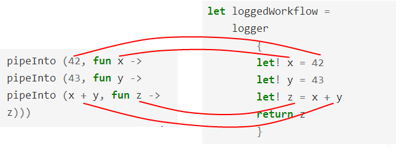

В предыдущей статье мы увидели, как с помощью вычислительных выражений можно сокращать довольно сложный код.

Вот код без вычислительных выражений:

```fsharp
let log p = printfn "expression is %A" p

let loggedWorkflow =
    let x = 42
    log x
    let y = 43
    log y
    let z = x + y
    log z
    // возвращаем
    z
```

А это — код с вычислительными выражениями:

```fsharp
let loggedWorkflow =
    logger
        {
        let! x = 42
        let! y = 43
        let! z = x + y
        return z
        }
```

Обратите внимание, что вместо оператора `let` используется оператор `let!`. Чтобы разобраться, как работет этот код, попробуем его эмулировать. Но прежде нам необходимо понять, как устроены продолжения.

## Продолжения

В императивном программировании существует концепция "возврата" из функции. Вызывая функцию, мы "входим в неё", а потом "возвращаемся обратно", точно также, как в случае со стеком — помещаем и возвращаем значения.

Вот достаточно типичный код на C#, который действует описанным способом. Обратие внимание на ключевое слово `return`.

```csharp
public int Divide(int top, int bottom)
{
    if (bottom==0)
    {
        throw new InvalidOperationException("div by 0");
    }
    else
    {
        return top/bottom;
    }
}

public bool IsEven(int aNumber)
{
    var isEven = (aNumber % 2 == 0);
    return isEven;
}
```

Вы видели подобное миллион раз, но, возможно, никогда не обращали внимание на тонкий момент, а именно: *вызываемая функция определят детали реализации*.

Например, функция `Divide` определяет, что при делении на ноль будет выбрасывать исключение. Но что если нам не нужно исключение? Что, если мы хотим результат типа `nullable<int>` или мы хотим вывести на экран сообщение "#DIV/0"? Зачем выбрасывать исключение, которое придётся немедленно перехватывать? Иными словами, почему бы решение о деталях не отдать на откуп вызывающей функции, а не вызываемой?

Также и в примере с `IsEven` не ясно, что я сделаю с полученным булевым значением. Вставлю в `if`? Или, возможно, помещу в отчёт? Я не знаю, но вместо того, чтобы возвращать логическое значение, почему бы мне не разрешить вызывающей функции определять, что делать дальше — в случае чётных и нечётных чисел?

Это именно то, чем являются продолжения. **Продолжение** — это функция, которую вы передаёте в другую функцию, чтобы сказать, что делать дальше.

Вот код на C#, переписанный так, чтобы вызывающая функция могла решать, что делать вызываемой в разных случаях. Если это поможет, вы можете думать об этом приёме, как о некой форме паттерна *Посетитель*. Или нет.

```csharp
public T Divide<T>(int top, int bottom, Func<T> ifZero, Func<int,T> ifSuccess)
{
    if (bottom==0)
    {
        return ifZero();
    }
    else
    {
        return ifSuccess( top/bottom );
    }
}

public T IsEven<T>(int aNumber, Func<int,T> ifOdd, Func<int,T> ifEven)
{
    if (aNumber % 2 == 0)
    {
        return ifEven(aNumber);
    }
    else
    {   return ifOdd(aNumber);
    }
}
```

Обратите вниманеие, что теперь функции возвращают значение обобщённого типа `T` и оба продолжения — это `Func`, которые возвращают `T`.

Да, в C# передача нескольких параметров типа `Func` выглядит достаточно уродливо, так что подобную технику используют не часто. Но в F# передача функций изящнее, поэтому взглянем, каким станет код после портирования.

Это код "до":

```fsharp
let divide top bottom =
    if (bottom=0)
    then invalidOp "div by 0"
    else (top/bottom)

let isEven aNumber =
    aNumber % 2 = 0
```

А это — код "после":

```fsharp
let divide ifZero ifSuccess top bottom =
    if (bottom=0)
    then ifZero()
    else ifSuccess (top/bottom)

let isEven ifOdd ifEven aNumber =
    if (aNumber % 2 = 0)
    then aNumber |> ifEven
    else aNumber |> ifOdd
```

Несколько замечаний. Во-первых, вы видите, что я добавил дополнительные функции (`ifZero` и прочие) в *начало* списка параметров, а не в конец, как в примере на C#. Почему? Потому что я, возможно, захочу воспользоваться [частичными применением](../partial-application/).

Во-вторых, я написал `aNumber |> ifEven` и `aNumber |> ifOdd` в теле функции `isEven`. Такая запись подчёркивает идею, что мы передаём значение в функцию-продолжение и продолжение всегда является последним шагом в вычислениях. *Мы будем часто применять этот паттерн в статье, так что убедитесь, что вы понимаете, как он работает.*

### Примеры продолжений

С обретённой мощью продолжений, мы можем использовать функцию `divide` тремя совершенно разными способами, в зависимости от того, что требуется вызывающей стороне.

Вот три сценария, которые мы можем быстро реализовать:

* превратить результат в сообщение и напечатать его,
* обернуть результат в тип `Option`, используя `None` для плохого сценария и `Some` для хорошего,
* или выбросить исключение в плохом случае и просто вернуть значение в хорошем.

```fsharp
// Сценарий 1: превращаем результат в сообщение
// ----------------------------------------
// готовим функции для печати сообщений
let ifZero1 () = printfn "bad"
let ifSuccess1 x = printfn "good %i" x

// используем частичное применение
let divide1  = divide ifZero1 ifSuccess1

// проверяем
let good1 = divide1 6 3
let bad1 = divide1 6 0

// Сценарий 2: оборачиваем результат в тип `Option`
// ----------------------------------------
// готовим функции для оборачивания
let ifZero2() = None
let ifSuccess2 x = Some x
let divide2  = divide ifZero2 ifSuccess2

// проверяем
let good2 = divide2 6 3
let bad2 = divide2 6 0

// Сценарий 3: выбрасываем исключение в случае ошибки
// ----------------------------------------
// готовим функции для исключения
let ifZero3() = failwith "div by 0"
let ifSuccess3 x = x
let divide3  = divide ifZero3 ifSuccess3

// проверяем
let good3 = divide3 6 3
let bad3 = divide3 6 0
```

Обратите внимание, что при таком подходе вызывающая сторона *никогда* не перехватывает исключения в функции `divide`. Именно вызывающая (а не вызываемая) сторона решает, надо ли выбрасывать исключение. Теперь функция `divide` не только больше подходит для использования в разных контекстах, но и снижается и уровень цикломатеической сложности.

Те же три сценария можно применить к реализации `isEven`:

```fsharp
// Сценарий 1: превращаем результат в сообщение
// ----------------------------------------
// готовим функции для печати сообщений
let ifOdd1 x = printfn "isOdd %i" x
let ifEven1 x = printfn "isEven %i" x

// используем частичное применение
let isEven1  = isEven ifOdd1 ifEven1

// проверяем
let good1 = isEven1 6
let bad1 = isEven1 5

// Сценарий 2: оборачиваем результат в тип `Option`
// ----------------------------------------
// готовим функции для оборачивания
let ifOdd2 _ = None
let ifEven2 x = Some x
let isEven2  = isEven ifOdd2 ifEven2

// проверяем
let good2 = isEven2 6
let bad2 = isEven2 5

// Сценарий 3: выбрасываем исключение в случае ошибки
// ----------------------------------------
// готовим функции для исключения
let ifOdd3 _ = failwith "assert failed"
let ifEven3 x = x
let isEven3  = isEven ifOdd3 ifEven3

// проверяем
let good3 = isEven3 6
let bad3 = isEven3 5
```

В этим примере преимущества не так очевидны, но, в любом случае: вызывающая стороная никогда не обрабатывает возвращаемый результат с помощью `if/then/else`. Сложность кода становится ниже, как и вероятность допустить ошибку.

Это может показаться тривиальной разницей, но, передавая фукнции подобным образом, мы можем использовать все наши любимые функциональные техники: композицию, частичное приминение и другие.

Мы уже встречали продолжения раньше, в серии статей про [проектирование с помощью типов](../designing-with-types-single-case-dus/). Мы видели, что их применение позволяет вызывающей стороне решать, что делать в случае ошибок валидации в конструкторе, вместо того, чтобы просто бросать исключения.

```fsharp
type EmailAddress = EmailAddress of string

let CreateEmailAddressWithContinuations success failure (s:string) =
    if System.Text.RegularExpressions.Regex.IsMatch(s,@"^\S+@\S+\.\S+$")
        then success (EmailAddress s)
        else failure "Email address must contain an @ sign"
```

Функция обработки в успешной ветке получает в качестве параметра электронный адрес, в то время, как функция обработки ошибки получает строку. Обе функции должны иметь одинаковый тип, и вы можете выбрать любой.

Вот простой пример использования продолжений. Обе функции вызывают `printf` и ничего не возвращают (то есть возвращают `unit`).

```fsharp
// готовим функции
let success (EmailAddress s) = printfn "success creating email %s" s
let failure  msg = printfn "error creating email: %s" msg
let createEmail = CreateEmailAddressWithContinuations success failure

// проверяем
let goodEmail = createEmail "x@example.com"
let badEmail = createEmail "example.com"
```

### Программирование через передачу продолжений

Использование продолжений описанным способом ведёт к стилю, который называется "[программированием через передачу продолжений](http://en.wikipedia.org/wiki/Continuation-passing_style)" (Continuation Passing Style, CPS). При этом *каждая* функция вызывается с дополнительным параметром-функцией "что делать дальше".

Чтобы увидеть разницу, давайте взглянем на стандартный стиль передачи управления.

Программируя в этом стиле, вы передаёте управление в функцию, а затем получаете его обратно:

```text
вызов функции ->
   <- возврат из функции
вызов функции ->
   <- возврат из функции
вызов функции ->
   <- возврат из функции
```

С другой стороны, если вы программируете через передачу продолжений, вы получаете цепочку вызовов:

```text
вычислить значение и передать его в ->
   функцию, которая вычисляет значение и передаёт его в ->
      другую функцию, которая вычисляет значение и передаёт его в ->
         ещё одну функцию, которая вычисляет значение и передаёт его в ->
            и так далее...
```

Очевидно, между этими стилями есть большая разница.

В случае передачи управления есть иерархия функций. Функция верхнего уровня — это, своего рода, "главный управляющий", который сначала вызывает одну подрограмму, затем другую; решает, когда нужны ветвления, а когда — циклы и, в целом, явным образом управляет потоком управления.

В случае передачи продолжений, как видим, нет ничего похожего на "главного управляющего". Вместо него, есть своеобразный канал — не данных, а потока управления — в котором исполняемая функция определяет, куда это управление будет передано.

Даже если вы просто присоединяли обработчик к событию нажатия кнопки в пользовательском интерфейсе, или использовали функцию обратного вызова в [BeginInvoke](http://msdn.microsoft.com/en-us/library/2e08f6yc.aspx), вы уже использовали этот стиль, даже не зная об этом. И, фактически, этот стиль окажется ключевым для понимания, как работает `async`, о чём мы поговорим позже в этом цикле.

## Продолжения и `let`

Так как всё это связано с `let`?

Давайте вернёмся назад и [перечитаем](/posts/let-use-do/), что в действительности делает `let`.

Вспомним, что (не на самом верхнем уровне) `let` никогда не может быть использован изолированно — он всегда должен быть частью большего блока кода.

То есть:

```fsharp
let x = someExpression
```

В действительности означает:

```fsharp
let x = someExpression in [выражение, где встречается x]
```

И потом, каждый раз, когда вы видите `x` во втором выражении (в теле выражения), подставляйте на его место первое выражение (`someExpression`).

Так, например, выражение:

```fsharp
let x = 42
let y = 43
let z = x + y
```

В действительности означает (с использованием громоздкого ключевого слова `in`):

```fsharp
let x = 42 in
  let y = 43 in
    let z = x + y in
       z    // результат
```

Достаточно забавно, что лямбды выглядят очень пожожими на `let`:

```fsharp
fun x -> [выражение, где встречается x]
```

И если мы свяжем `x` с лямбдой конвейерным оператором, мы получим следующее:

```fsharp
someExpression |> (fun x -> [выражение, где встречается x] )
```

Разве этот код не похож на страшную версию `let`? Вот `let` и лямбда, записанные рядом:

```fsharp
// let
let x = someExpression in [выражение, где встречается x]

// конвейер из значения и лямбды
someExpression |> (fun x -> [выражение, где встречается x] )
```

В обеих записях есть `x` и `someExpression`, и везде, где вы видите `x` в теле лямбды, мы заменяете его на `someExpression`.
Да, `x` и `someExpression` в записи лямбды меняются местами, но по сути это то же самое, что и `let`.

Теперь, используя эту технику, мы можем переписать оригинальный пример в новом стиле:

```fsharp
42 |> (fun x ->
  43 |> (fun y ->
     x + y |> (fun z ->
       z)))
```

Когда пример записан подобным образом, мы видим, что запись в стиле `let` трансформировалась в запись через передачу прдолжений.

* В первой строке у нас значение `42` — что мы с ним cделаем?
* Давайте передадим его в продолжение, как мы ранее делали с функцией `isEven`. В контексте продолжения переименуем `42` в `x`.
* Во второй строке у нас значение `43` — что мы с ним cделаем? Давайте передадим его в продолжение, в контексте которого назовём его `y`.
* В третьей строке мы складываем `x` и `y`, чтобы создать новое значение. Что мы с ним сделаем? Снова передадим его в продолжение и назовём `z`.
* Наконец, в последней строке мы завершаем и `z` становится значением всего выражения.

### Оборачивание продолжения в функцию

Давайте избавимся от явного конвейера и напишем небольшую функцию, чтобы обернуть эту логику. Мы не можем назвать её "let", потому что это ключевое слово и, что более важно, потому что порядок параметров здесь проитивоположен. Параметр `x` находится справа, а `someExpression` — слева. Исходя из этого, назовём функцию `pipeInto` (с учётом контекста, означает что-то вроде «передать по конвейеру»).

Определение `pipeInfo` поистине очевидно:

```fsharp
let pipeInto (someExpression,lambda) =
    someExpression |> lambda
```

*Обратите внимание, что мы передаём оба параметра как один, заключив их в кортеж, вместо того, чтобы передать их раздельно, перчислив через пробел. Они всегда идут парой.*

Теперь, благодаря `pipeInfo`, мы можем ещё раз переписать пример таким образом:

```fsharp
pipeInto (42, fun x ->
  pipeInto (43, fun y ->
    pipeInto (x + y, fun z ->
       z)))
```

Или мы можем устранить вложенность и записать всё вот так:

```fsharp
pipeInto (42, fun x ->
pipeInto (43, fun y ->
pipeInto (x + y, fun z ->
z)))
```

Вы, должно быть, думаете: ну и что? Зачем тратить время на оборачивание конвейера в функцию?

Ответ заключается в том, что мы можем реализовать *дополнительную логику* в функции `pipeInto`, чтобы неявно делать разные штуки также, как это происходит в вычислительных выражениях.

### Переписываем логгирование

Давайте переопределим `pipeInto`, чтоыб добавить немного логгирования, как здесь:

```fsharp
let pipeInto (someExpression,lambda) =
   printfn "expression is %A" someExpression
   someExpression |> lambda
```

И... снова запустим код.

```fsharp
pipeInto (42, fun x ->
pipeInto (43, fun y ->
pipeInto (x + y, fun z ->
z
)))
```

Что получим на выходе?

```text
expression is 42
expression is 43
expression is 85
```

Это в точности такой же вывод, который мы наблюдали в ранних реализациях. Мы создали собственный движок для вычислительных выражений!

Если мы сравним своё решение с обычным вычислительным выражением, мы увидим, что наша доморощенная функция весьма похожа на `let!`, за тем исключением, что параметры идут в обратном поррядке и для продолжения явно используется стрелка.



### Переписываем "безопасное деление"

Давайте сделаем то же самое с безопасным делением. Вот оригинальный код:

```fsharp
let divideBy bottom top =
    if bottom = 0
    then None
    else Some(top/bottom)

let divideByWorkflow x y w z =
    let a = x |> divideBy y
    match a with
    | None -> None  // останавливаемся
    | Some a' ->    // продолжаем
        let b = a' |> divideBy w
        match b with
        | None -> None  // останавливаемся
        | Some b' ->    // продолжаем
            let c = b' |> divideBy z
            match c with
            | None -> None  // останавливаемся
            | Some c' ->    // продолжаем
                // возвращаем
                Some c'
```

Теперь вы понимаете, что такая «лесенка» является очевидной подсказкой, что нам следует использовать продолжения.

Проверим, сможем ли мы реализовать *дополнительную логику* в `pipeInto`, чтобы она делала что-то подобное. Мы хотеим, чтобы фукнция:

* Если `someExpression` не содержит значения (`None`), не вызывать лямбду-продолжение.
* Если `someExpression` содержит значение (`Some` *что-то*), передавать это *что-то* в лямбду-продолжение.

Получается что-то вроде этого:

```fsharp
let pipeInto (someExpression,lambda) =
   match someExpression with
   | None ->
       None
   | Some x ->
       x |> lambda
```

С новой версией `pipeInto`, мы можем переписать оригинальный код вот так:

```fsharp
let divideByWorkflow x y w z =
    let a = x |> divideBy y
    pipeInto (a, fun a' ->
        let b = a' |> divideBy w
        pipeInto (b, fun b' ->
            let c = b' |> divideBy z
            pipeInto (c, fun c' ->
                Some c' // возвращаем
                )))
```

Этот код можно немного почистить.

Во-первых, мы можем избавиться от `a`, `b` и `c`, заменив их выражением `divideBy`. Такой код:

```fsharp
let a = x |> divideBy y
pipeInto (a, fun a' ->
```

Станет таким:

```fsharp
pipeInto (x |> divideBy y, fun a' ->
```

Теперь переименовываем `a'` в `a` и так далее, и параллельно избавляемся от лесенки. Вот что у нас получилось:

```fsharp
let divideByResult x y w z =
    pipeInto (x |> divideBy y, fun a ->
    pipeInto (a |> divideBy w, fun b ->
    pipeInto (b |> divideBy z, fun c ->
    Some c // возвращаем
    )))
```

Наконец, создаим небольшую вспомогательную функцию и назовём её `return`. Она будет оборачивать результат вычисления. После того, как мы сведём всё воедино, код приобретёт следующий вид:

```fsharp
let divideBy bottom top =
    if bottom = 0
    then None
    else Some(top/bottom)

let pipeInto (someExpression,lambda) =
   match someExpression with
   | None ->
       None
   | Some x ->
       x |> lambda

let return' c = Some c

let divideByWorkflow x y w z =
    pipeInto (x |> divideBy y, fun a ->
    pipeInto (a |> divideBy w, fun b ->
    pipeInto (b |> divideBy z, fun c ->
    return' c
    )))

let good = divideByWorkflow 12 3 2 1
let bad = divideByWorkflow 12 3 0 1
```

И снова, если мы пострчно сравним этот код с аналогичным вычислительным выражением, мы увидим, что наша доморощенная версия по сути идентична. Различается только синтаксис.


### Заключение

В этом посте мы говорили о продолжениях, о программировании через продолжения, и о том, что мы можем думать об операторе `let` как о красивом синтаксисе, скрывающим вызов продолжений.

Теперь у нас есть всё, чтобы начать делать *свою* версию `let`. В следующем посте мы применим новые знания на практике.
