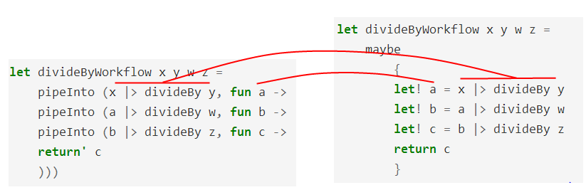

> In the previous post we saw how some complex code could be condensed using computation expressions.

В предыдущей статье мы увидели, как с помощью вычислительных выражений можно сокращать довольно сложный код.

> Here's the code before using a computation expression:

Вот код без вычислительных выражений:

```fsharp

let log p = printfn "expression is %A" p

let loggedWorkflow =
    let x = 42
    log x
    let y = 43
    log y
    let z = x + y
    log z
    // возвращаем
    z
```

> And here's the same code after using a computation expression:

А это — код с вычислительными выражениями:

```fsharp
let loggedWorkflow =
    logger
        {
        let! x = 42
        let! y = 43
        let! z = x + y
        return z
        }
```

> The use of `let!` rather than a normal `let` is important.  Can we emulate this ourselves so we can understand what is going on?  Yes, but we need to understand continuations first.

Обратите внимание, что вместо оператора `let` используется оператор `let!`. Чтобы разобраться, как работет этот код, попробуем его эмулировать. Но прежде нам необходимо понять, как устроены продолжения.

> ## Continuations

## Продолжения

> In imperative programming, we have the concept of "returning" from a function. When you call a function, you "go in", and then you "come out", just like pushing and popping a stack.

В императивном программировании существует концепция "возврата" из функции. Вызывая функцию, мы "входим в неё", а потом "возвращаемся обратно", точно также, как в случае со стеком — помещаем и возвращаем значения.

> Here is some typical C# code which works like this. Notice the use of the `return` keyword.

Вот достаточно типичный код на C#, который действует описанным способом. Обратие внимание на ключевое слово `return`.


```csharp
public int Divide(int top, int bottom)
{
    if (bottom==0)
    {
        throw new InvalidOperationException("div by 0");
    }
    else
    {
        return top/bottom;
    }
}

public bool IsEven(int aNumber)
{
    var isEven = (aNumber % 2 == 0);
    return isEven;
}
```

> You've seen this a million times, but there is a subtle point about this approach that you might not have considered: *the called function always decides what to do*.

Вы видели подобное миллион раз, но, возможно, никогда не обращали внимание на тонкий момент, а именно: *вызываемая функция определят детали реализации*.

> For example, the implementation of `Divide` has decided that it is going to throw an exception.  But what if I don't want an exception? Maybe I want a `nullable<int>`, or maybe I am going to display it on a screen as "#DIV/0". Why throw an exception that I am immediately going to have to catch?  In other words, why not let the *caller* decide what should happen, rather the callee.

Например, функция `Divide` определяет, что при делении на ноль будет выбрасывать исключение. Но что если нам не нужно исключение? Что, если мы хотим результат типа `nullable<int>` или мы хотим вывести на экран сообщение "#DIV/0"? Зачем выбрасывать исключение, которое придётся немедленно перехватывать? Иными словами, почему бы решение о деталях не отдать на откуп вызывающей функции, а не вызываемой?

> Similarly in the `IsEven` example, what am I going to do with the boolean return value? Branch on it? Or maybe print it in a report? I don't know, but again, rather than returning a boolean that the caller has to deal with, why not let the caller tell the callee what to do next?

Также и в примере с `IsEven` не ясно, что я сделаю с полученным булевым значением. Вставлю в `if`? Или, возможно, помещу в отчёт? Я не знаю, но вместо того, чтобы возвращать логическое значение, почему бы мне не разрешить вызывающей функции определять, что делать дальше — в случае чётных и нечётных чисел?

> So this is what continuations are.  A **continuation** is simply a function that you pass into another function to tell it what to do next.

Это именно то, чем являются продолжения. **Продолжение** — это функция, которую вы передаёте в другую функцию, чтобы сказать, что делать дальше.

> Here's the same C# code rewritten to allow the caller to pass in functions which the callee uses to handle each case. If it helps, you can think of this as somewhat analogous to a visitor pattern. Or maybe not.

Вот код на C#, переписанный так, чтобы вызывающая функция могла решать, что делать вызываемой в разных случаях. Если это поможет, вы можете думать об этом приёме, как о некой форме паттерна *Посетитель*. Или нет.

```csharp
public T Divide<T>(int top, int bottom, Func<T> ifZero, Func<int,T> ifSuccess)
{
    if (bottom==0)
    {
        return ifZero();
    }
    else
    {
        return ifSuccess( top/bottom );
    }
}

public T IsEven<T>(int aNumber, Func<int,T> ifOdd, Func<int,T> ifEven)
{
    if (aNumber % 2 == 0)
    {
        return ifEven(aNumber);
    }
    else
    {   return ifOdd(aNumber);
    }
}
```

> Note that the C# functions have been changed to return a generic `T` now, and both continuations are a `Func` that returns a `T`.

Обратите вниманеие, что теперь функции возвращают значение обобщённого типа `T` и оба продолжения — это `Func`, которые возвращают `T`.

> Well, passing in lots of `Func` parameters always looks pretty ugly in C#, so it is not done very often.  But passing functions is easy in F#, so let's see how this code ports over.

Да, в C# передача нескольких параметров типа `Func` выглядит достаточно уродливо, так что подобную технику используют не часто. Но в F# передача функций изящнее, поэтому взглянем, каким станет код после портирования.

> Here's the "before" code:

Это код "до":

```fsharp
let divide top bottom =
    if (bottom=0)
    then invalidOp "div by 0"
    else (top/bottom)

let isEven aNumber =
    aNumber % 2 = 0
```

> and here's the "after" code:

А это — код "после":

```fsharp
let divide ifZero ifSuccess top bottom =
    if (bottom=0)
    then ifZero()
    else ifSuccess (top/bottom)

let isEven ifOdd ifEven aNumber =
    if (aNumber % 2 = 0)
    then aNumber |> ifEven
    else aNumber |> ifOdd
```

> A few things to note. First, you can see that I have put the extra functions (`ifZero`, etc) *first* in the parameter list, rather than last, as in the C# example. Why? Because I am probably going to want to use [partial application](/posts/partial-application/).

Несколько замечаний. Во-первых, вы видите, что я добавил дополнительные функции (`ifZero` и прочие) в *начало* списка параметров, а не в конец, как в примере на C#. Почему? Потому что я, возможно, захочу воспользоваться [частичными применением](../partial-application/).

> And also, in the `isEven` example, I wrote `aNumber |> ifEven` and `aNumber |> ifOdd`. This makes it clear that we are piping the current value into the continuation and the continuation is always the very last step to be evaluated.  *We will be using this exact same pattern later in this post, so make sure you understand what is going on here.*

Во-вторых, я написал `aNumber |> ifEven` и `aNumber |> ifOdd` в теле функции `isEven`. Такая запись подчёркивает идею, что мы передаём значение в функцию-продолжение и продолжение всегда является последним шагом в вычислениях. *Мы будем часто применять этот паттерн в статье, так что убедитесь, что вы понимаете, как он работает.*

> ### Continuation examples

### Примеры продолжений

> With the power of continuations at our disposal, we can use the same `divide` function in three completely different ways, depending on what the caller wants.

С обретённой мощью продолжений, мы можем использовать функцию `divide` тремя совершенно разными способами, в зависимости от того, что требуется вызывающей стороне.

> Here are three scenarios we can create quickly:

Вот три сценария, которые мы можем быстро реализовать:

> * pipe the result into a message and print it,
> * convert the result to an option using `None` for the bad case and `Some` for the good case,
> * or throw an exception in the bad case and just return the result in the good case.

* превратить результат в сообщение и напечатать его,
* обернуть результат в тип `Option`, используя `None` для плохого сценария и `Some` для хорошего,
* или выбросить исключение в плохом случае и просто вернуть значение в хорошем.

```fsharp
// Сценарий 1: первраащем результат в сообщение
// ----------------------------------------
// готовим функции для печати сообщений
let ifZero1 () = printfn "bad"
let ifSuccess1 x = printfn "good %i" x

// используем частичное применение
let divide1  = divide ifZero1 ifSuccess1

// проверяем
let good1 = divide1 6 3
let bad1 = divide1 6 0

// Сценарий 2: оборачиваем результат в тип `Option`
// ----------------------------------------
// готовим функции для оборачивания
let ifZero2() = None
let ifSuccess2 x = Some x
let divide2  = divide ifZero2 ifSuccess2

// проверяем
let good2 = divide2 6 3
let bad2 = divide2 6 0

// Сценарий 3: выбрасываем исключение в случае ошибки
// ----------------------------------------
// готовим функции для исключения
let ifZero3() = failwith "div by 0"
let ifSuccess3 x = x
let divide3  = divide ifZero3 ifSuccess3

// проверяем
let good3 = divide3 6 3
let bad3 = divide3 6 0
```

> Notice that with this approach, the caller *never* has to catch an exception from `divide` anywhere. The caller decides whether an exception will be thrown, not the callee. So not only has the `divide` function become much more reusable in different contexts,  but the cyclomatic complexity has just dropped a level as well.

Обратите внимание, что при таком подходе вызывающая сторона *никогда* не перехватывает исключения в функции `divide`. Именно вызывающая (а не вызываемая) сторона решает, надо ли выбрасывать исключение. Теперь функция `divide` не только больше подходит для использования в разных контекстах, но и снижается и уровень цикломатеической сложности.

> The same three scenarios can be applied to the `isEven` implementation:

Те же три сценария можно применить к реализации `isEven`:

```fsharp
// Сценарий 1: первраащем результат в сообщение
// ----------------------------------------
// готовим функции для печати сообщений
let ifOdd1 x = printfn "isOdd %i" x
let ifEven1 x = printfn "isEven %i" x

// используем частичное применение
let isEven1  = isEven ifOdd1 ifEven1

// проверяем
let good1 = isEven1 6
let bad1 = isEven1 5

// Сценарий 2: оборачиваем результат в тип `Option`
// ----------------------------------------
// готовим функции для оборачивания
let ifOdd2 _ = None
let ifEven2 x = Some x
let isEven2  = isEven ifOdd2 ifEven2

// проверяем
let good2 = isEven2 6
let bad2 = isEven2 5

// Сценарий 3: выбрасываем исключение в случае ошибки
// ----------------------------------------
// готовим функции для исключения
let ifOdd3 _ = failwith "assert failed"
let ifEven3 x = x
let isEven3  = isEven ifOdd3 ifEven3

// проверяем
let good3 = isEven3 6
let bad3 = isEven3 5
```

> In this case, the benefits are subtler, but the same: the caller never had to handle booleans with an `if/then/else` anywhere.  There is less complexity and less chance of error.

В этим примере преимущества не так очевидны, но, в любом случае: вызывающая стороная никогда не обрабатывает возвращаемый результат с помощью `if/then/else`. Сложность кода становится ниже, как и вероятность допустить ошибку.

> It might seem like a trivial difference, but by passing functions around like this, we can use all our favorite functional techniques such as composition, partial application, and so on.

Это может показаться тривиальной разницей, но, передавая фукнции подобным образом, мы можем использовать все наши любимые функциональные техники: композицию, частичное приминение и другие.

> We have also met continuations before, in the series on [designing with types](/posts/designing-with-types-single-case-dus/). We saw that their use enabled the caller to decide what would happen in case of possible validation errors in a constructor, rather than just throwing an exception.

Мы уже встречали продолжения раньше, в серии статей про [проектирование с помощью типов](../designing-with-types-single-case-dus/). Мы видели, что их применение позволяет вызывающей стороне решать, что делать в случае ошибок валидации в конструкторе, вместо того, чтобы просто бросать исключения.

```fsharp
type EmailAddress = EmailAddress of string

let CreateEmailAddressWithContinuations success failure (s:string) =
    if System.Text.RegularExpressions.Regex.IsMatch(s,@"^\S+@\S+\.\S+$")
        then success (EmailAddress s)
        else failure "Email address must contain an @ sign"
```

> The success function takes the email as a parameter and the error function takes a string. Both functions must return the same type, but the type is up to you.

Функция обработки в успешной ветке получает в качестве параметра электронный адрес, в то время, как функция обработки ошибки получает строку. Обе функции должны иметь одинаковый тип, и вы можете выбрать любой.

> And here is a simple example of the continuations in use. Both functions do a printf, and return nothing (i.e. unit).

Вот простой пример использования продолжений. Обе функции вызывают `printf` и ничего не возвращают (то есть возвращают `unit`).

```fsharp
// готовим функции
let success (EmailAddress s) = printfn "success creating email %s" s
let failure  msg = printfn "error creating email: %s" msg
let createEmail = CreateEmailAddressWithContinuations success failure

// проверяем
let goodEmail = createEmail "x@example.com"
let badEmail = createEmail "example.com"
```

> ### Continuation passing style

### Программирование через передачу продолжений

> Using continuations like this leads to a style of programming called "[continuation passing style](http://en.wikipedia.org/wiki/Continuation-passing_style)" (or CPS), whereby *every* function is called with an extra "what to do next" function parameter.

Использование продолжений описанным способом ведёт к стилю, который называется "[программированием через передачу продолжений](http://en.wikipedia.org/wiki/Continuation-passing_style)" (Continuation Passing Style, CPS). При этом *каждая* функция вызывается с дополнительным параметром-функцией "что делать дальше".

> To see the difference, let's look at the standard, direct style of programming.

Чтобы увидеть разницу, давайте взглянем на стандартный стиль передачи управления.

> When you use the direct style, you go "in" and "out" of functions, like this

Программируя в этом стиле, вы передаёте управление в функцию, а затем получаете его обратно:

```text
вызов функции ->
   <- возврат из функции
вызов функции ->
   <- возврат из функции
вызов функции ->
   <- возврат из функции
```

> In continuation passing style, on the other hand, you end up with a chain of functions, like this:

С другой стороны, если вы программируете через передачу продолжений, вы получаете цепочку вызовов:

```text
вычислить значение и передать его в ->
   функцию, которая вычисляет значение и передаёт его в ->
      другую функцию, которая вычисляет значение и передаёт его в ->
         ещё одну функцию, которая вычисляет значение и передаёт его в ->
            и так далее...
```

> There is obviously a big difference between the two styles.

Очевидно, между этими стилями есть большая разница.

> In the direct style, there is a hierarchy of functions. The top level function is a sort of "master controller" who calls one subroutine, and then another, deciding when to branch, when to loop, and generally coordinating the control flow explicitly.

В случае передачи управления есть иерархия функций. Функция верхнего уровня — это, своего рода, "главный управляющий", который сначала вызывает одну подрограмму, затем другую; решает, когда нужны ветвления, а когда — циклы и, в целом, явным образом управляет потоком управления.

> In the continuation passing style, though, there is no "master controller". Instead there is a sort of "pipeline", not of data but of control flow, where the "function in charge" changes as the execution logic flows through the pipe.

В случае передачи продолжений, как видим, нет ничего похожего на "главного управляющего". Вместо него, есть своеобразный канал — не данных, а потока управления — в котором исполняемая функция определяет, куда это управление будет передано.

> If you have ever attached a event handler to a button click in a GUI, or used a callback with [BeginInvoke](http://msdn.microsoft.com/en-us/library/2e08f6yc.aspx), then you have used this style without being aware of it. And in fact, this style will be key to understanding the `async` workflow, which I'll discuss later in this series.

Даже если вы просто присоединяли обработчик к событию нажатия кнопки в пользовательском интерфейсе, или использовали функцию обратного вызова в [BeginInvoke](http://msdn.microsoft.com/en-us/library/2e08f6yc.aspx), вы уже использовали этот стиль, даже не зная об этом. И, фактически, этот стиль окажется ключевым для понимания, как работает `async`, о чём мы поговорим позже в этом цикле.

> ## Continuations and 'let' ##

## Продолжения и `let`

> So how does all this fit in with `let`?

Так как всё это связано с `let`?

> Let's go back and [revisit](/posts/let-use-do/) what 'let` actually does.

Давайте вернёмся назад и [перечитаем](/posts/let-use-do/), что в действительности делает `let`.

> Remember that a (non-top-level) "let" can never be used in isolation -- it must always be part of a larger code block.

Вспомним, что (не на самом верхнем уровне) `let` никогда не может быть использован изолированно — он всегда должен быть частью большего блока кода.

> That is:

То есть:

```fsharp
let x = someExpression
```

> really means:

в действительности означает:

```fsharp
let x = someExpression in [выражение, где встречается x]
```

> And then every time you see the `x` in the second expression (the body expression), substitute it with the first expression (`someExpression`).

И потом, каждый раз, когда вы видите `x` во втором выражении (в теле выражения), подставляйте на его место первое выражение (`someExpression`).

> So for example, the expression:

Так, например, выражение:

```fsharp
let x = 42
let y = 43
let z = x + y
```

> really means (using the verbose `in` keyword):

в действительности означает (с использованием громоздкого ключевого слова `in`):

```fsharp
let x = 42 in
  let y = 43 in
    let z = x + y in
       z    // результат
```

> Now funnily enough, a lambda looks very similar to a `let`:

Достаточно забавно, что лямбды выглядят очень пожожими на `let`:


```fsharp
fun x -> [выражение, где встречается x]
```

> and if we pipe in the value of `x` as well, we get the following:

и если мы свяжем `x` с лямбдой конвейерным оператором, мы получим следующее:

```fsharp
someExpression |> (fun x -> [выражение, где встречается x] )
```

> Doesn't this look awfully like a `let` to you? Here is a let and a lambda side by side:

Разве этот код не похож на страшную версию `let`? Вот `let` и лямбда, записанные рядом:

```fsharp
// let
let x = someExpression in [выражение, где встречается x]

// конвейер из значения и лямбды
someExpression |> (fun x -> [выражение, где встречается x] )
```

> They both have an `x`, and a `someExpression`, and everywhere you see `x` in the body of the lambda you replace it with  `someExpression`.
> Yes, the `x` and the `someExpression` are reversed in the lambda case, but otherwise it is basically the same thing as a `let`.

В обеих записях есть `x` и `someExpression`, и везде, где вы видите `x` в теле лямбды, мы заменяете его на `someExpression`.
Да, `x` и `someExpression` в записи лямбды меняются местами, но по сути это то же самое, что и `let`.

> So, using this technique, we can rewrite the original example in this style:

Теперь, используя эту технику, мы можем переписать оригинальный пример в новом стиле:

```fsharp
42 |> (fun x ->
  43 |> (fun y ->
     x + y |> (fun z ->
       z)))
```

> When it is written this way, you can see that we have transformed the `let` style into a continuation passing style!

Когда пример записан подобным образом, мы видим, что запись в стиле `let` трансформировалась в запись через передачу прдолжений.

> * In the first line we have a value `42` -- what do we want to do with it? Let's pass it into a continuation, just as we did with the `isEven` function earlier. And in the context of the continuation, we will relabel `42` as `x`.
> * In the second line we have a value `43` -- what do we want to do with it? Let's pass it too into a continuation, calling it `y` in that context.
> * In the third line we add the x and y together to create a new value. And what do we want to do with it? Another continuation, another label (`z`).
> * Finally in the last line we are done and the whole expression evaluates to `z`.

* В первой строке у нас значение `42` — что мы с ним cделаем?
* Давайте передадим его в продолжение, как мы ранее делали с функцией `isEven`. В контексте продолжения переименуем `42` в `x`.
* Во второй строке у нас значение `43` — что мы с ним cделаем? Давайте передадим его в продолжение, в контексте которого назовём его `y`.
* В третьей строке мы складываем `x` и `y`, чтобы создать новое значение. Что мы с ним сделаем? Снова передадим его в продолжение и назовём `z`.
* Наконец, в последней строке мы завершаем и `z` становится значением всего выражения.

> ### Wrapping the continuation in a function

> Let's get rid of the explicit pipe and write a little function to wrap this logic. We can't call it "let" because that is a reserved word, and more importantly, the parameters are backwards from 'let'.
> The "x" is on the right hand side, and the "someExpression" is on the left hand side. So we'll call it `pipeInto` for now.

> The definition of `pipeInto` is really obvious:

```fsharp
let pipeInto (someExpression,lambda) =
    someExpression |> lambda
```

> *Note that we are passing both parameters in at once using a tuple rather than as two distinct parameters separated by whitespace. They will always come as a pair.*

> So, with this `pipeInto` function we can then rewrite the example once more as:

```fsharp
pipeInto (42, fun x ->
  pipeInto (43, fun y ->
    pipeInto (x + y, fun z ->
       z)))
```

> or we can eliminate the indents and write it like this:

```fsharp
pipeInto (42, fun x ->
pipeInto (43, fun y ->
pipeInto (x + y, fun z ->
z)))
```

> You might be thinking: so what? Why bother to wrap the pipe into a function?

> The answer is that we can add *extra code* in the `pipeInto` function to do stuff "behind the scenes", just as in a computation expression.

> ### The "logging" example revisited ###

> Let's redefine `pipeInto` to add a little bit of logging, like this:

```fsharp
let pipeInto (someExpression,lambda) =
   printfn "expression is %A" someExpression
   someExpression |> lambda
```

> Now... run that code again.

```fsharp
pipeInto (42, fun x ->
pipeInto (43, fun y ->
pipeInto (x + y, fun z ->
z
)))
```

> What is the output?

```text
expression is 42
expression is 43
expression is 85
```

> This is exactly the same output as we had in the earlier implementations.  We have created our own little computation expression workflow!

> If we compare this side by side with the computation expression version, we can see that our homebrew version is very similar to the `let!`, except that we have the parameters reversed, and we have the explicit arrow for the continuation.


> ### The "safe divide" example revisited ###

> Let's do the same thing with the "safe divide" example. Here was the original code:

```fsharp
let divideBy bottom top =
    if bottom = 0
    then None
    else Some(top/bottom)

let divideByWorkflow x y w z =
    let a = x |> divideBy y
    match a with
    | None -> None  // give up
    | Some a' ->    // keep going
        let b = a' |> divideBy w
        match b with
        | None -> None  // give up
        | Some b' ->    // keep going
            let c = b' |> divideBy z
            match c with
            | None -> None  // give up
            | Some c' ->    // keep going
                //return
                Some c'
```

> You should see now that this "stepped" style is an obvious clue that we really should be using continuations.

> Let's see if we can add extra code to `pipeInto` to do the matching for us. The logic we want is:

> * If the `someExpression` parameter is `None`, then don't call the continuation lambda.
> * If the `someExpression` parameter is `Some`, then do call the continuation lambda, passing in the contents of the `Some`.

> Here it is:

```fsharp
let pipeInto (someExpression,lambda) =
   match someExpression with
   | None ->
       None
   | Some x ->
       x |> lambda
```

> With this new version of `pipeInto` we can rewrite the original code like this:

```fsharp
let divideByWorkflow x y w z =
    let a = x |> divideBy y
    pipeInto (a, fun a' ->
        let b = a' |> divideBy w
        pipeInto (b, fun b' ->
            let c = b' |> divideBy z
            pipeInto (c, fun c' ->
                Some c' //return
                )))
```

> We can clean this up quite a bit.

> First we can eliminate the `a`, `b` and `c`, and replace them with the `divideBy` expression directly. So that this:

```fsharp
let a = x |> divideBy y
pipeInto (a, fun a' ->
```

> becomes just this:

```fsharp
pipeInto (x |> divideBy y, fun a' ->
```

> Now we can relabel `a'` as just `a`, and so on, and we can also remove the stepped indentation, so that we get this:

```fsharp
let divideByResult x y w z =
    pipeInto (x |> divideBy y, fun a ->
    pipeInto (a |> divideBy w, fun b ->
    pipeInto (b |> divideBy z, fun c ->
    Some c //return
    )))
```

> Finally, we'll create a little helper function called `return'` to wrap the result in an option. Putting it all together, the code looks like this:

```fsharp
let divideBy bottom top =
    if bottom = 0
    then None
    else Some(top/bottom)

let pipeInto (someExpression,lambda) =
   match someExpression with
   | None ->
       None
   | Some x ->
       x |> lambda

let return' c = Some c

let divideByWorkflow x y w z =
    pipeInto (x |> divideBy y, fun a ->
    pipeInto (a |> divideBy w, fun b ->
    pipeInto (b |> divideBy z, fun c ->
    return' c
    )))

let good = divideByWorkflow 12 3 2 1
let bad = divideByWorkflow 12 3 0 1
```

> Again, if we compare this side by side with the computation expression version, we can see that our homebrew version is identical in meaning. Only the syntax is different.



> ### Summary

> In this post, we talked about continuations and continuation passing style, and how we can think of `let` as a nice syntax for doing continuations behind scenes.

> So now we have everything we need to start creating our *own* version of `let`. In the next post, we'll put this knowledge into practice.

