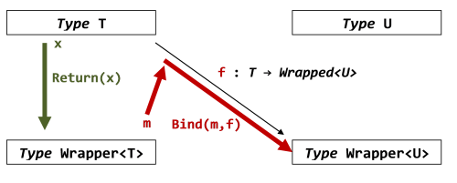

> In the previous post, we were introduced to the "maybe" workflow, which allowed us to hide the messiness of chaining together option types.

В предыдущем посте мы представили процесс "maybe", который позволил нам спрятать мешанину, возникающую при объединении опциональных типов.

> A typical use of the "maybe" workflow looked something like this:

Типичное использование процесса "maybe" выглидит как-то так:

```fsharp
let result =
    maybe
        {
        let! anInt = expression of Option<int>
        let! anInt2 = expression of Option<int>
        return anInt + anInt2
        }
```

> As we saw before, there is some apparently strange behavior going on here:

Как мы отмечали раньше, здесь есть одна явно странная штука: 

> * In the `let!` lines, the expression on the *right* of the equals is an `int option`, but the value on the *left* is just an `int`.
>   The `let!` has "unwrapped" the option before binding it to the value.

> * And in the `return` line, the opposite occurs.
>   The expression being returned is an `int`, but the value of the whole workflow (`result`) is an `int option`.
>   That is, the `return` has "wrapped" the raw value back into an option.

* В строках с конструкцей `let!`, выражение *справа* от знака равенства имеет тип `int option`, при этом значение *слева* имеет тип `int`.
  `let!` "разворачивает" опциональный тип перед тем, как связать его со значением.
* В строке `return` всё наоборот.
  Возвращаемое выражение имеет тип `int`, но значение всего вычислительного выражения (`result`) имеет тип `int option`.
  То есть, `return` "заворачивает" обычное значение обратно в опциональный тип.

> We will follow up these observations in this post, and we will see that this leads to one of the major uses of computation expressions: namely, to implicitly unwrap and rewrap values that are stored in some sort of wrapper type.

В этом посте мы не раз столкнёмся с подобными наблюдениями, и увидим, что это ведет к одному из основных способов применения вычислительных выражений, а именно: неявное "разворачивание" и "заворачивание" значений, хранящихся в каком-то типе-обёртке.

> ## Another example

## Другой пример

> Let's look at another example.
> Say that we are accessing a database, and we want to capture the result in a Success/Error union type, like this:

Взглянем на другой пример.
Скажем, мы обращаемся к базе данных, и хотим получать результат в виде типа-объединения Удача/Ошибка, как здесь:

```fsharp
type DbResult<'a> =
    | Success of 'a
    | Error of string
```

> We then use this type in our database access methods.
> Here are some very simple stubs to give you an idea of how the `DbResult` type might be used:

Теперь мы можем использовать этот тип в наших методах доступа к базе данных.
Вот несколько простых заглучшек, которые дадут вам представление, как можно использовать тип `DbResult`:

```fsharp
let getCustomerId name =
    if (name = "")
    then Error "ошибка в getCustomerId"
    else Success "Cust42"

let getLastOrderForCustomer custId =
    if (custId = "")
    then Error "ошибка в getLastOrderForCustomer"
    else Success "Order123"

let getLastProductForOrder orderId =
    if (orderId  = "")
    then Error "ошибка в getLastProductForOrder"
    else Success "Product456"
```

> Now let's say we want to chain these calls together.
> First get the customer id from the name, and then get the order for the customer id, and then get the product from the order.

Теперь представим, что нам надо выполнить эти вызовы последовательно.
Сначала получаем идентификатор покупателя по имени, затем — заказ по идентификатору покупателя, и, наконец — товар по идентификатору заказа.

> Here's the most explicit way of doing it.
> As you can see, we have to have pattern matching at each step.

Вот самый очевидный способ решить эту задачу.
Вы видите, что на каждом шаге мы вынуждены использовать сопоставление с образцом.

```fsharp
let product =
    let r1 = getCustomerId "Алиса"
    match r1 with
    | Error _ -> r1
    | Success custId ->
        let r2 = getLastOrderForCustomer custId
        match r2 with
        | Error _ -> r2
        | Success orderId ->
            let r3 = getLastProductForOrder orderId
            match r3 with
            | Error _ -> r3
            | Success productId ->
                printfn "Товар %s" productId
                r3
```

> Really ugly code.
> And the top-level flow has been submerged in the error handling logic.

Поистине ужасный код.
И основная логика процесса смешалась с логикой обработки ошибок.

> Computation expressions to the rescue!
> We can write one that handles the branching of Success/Error behind the scenes:

Вычислительные выражения спешат на помощь!
Мы можем написать выражение, которое само проверяет наличие Ошибки:

```fsharp
type DbResultBuilder() =

    member this.Bind(m, f) =
        match m with
        | Error _ -> m
        | Success a ->
            printfn "\tУдачно: %s" a
            f a

    member this.Return(x) =
        Success x

let dbresult = new DbResultBuilder()
```

> 
> Note that the "builder" in the context of a computation expression is not the same as the OO "builder pattern" for constructing and validating objects.
> There is a post on the ["builder pattern" here](../builder-pattern).
> 


Ещё раз обратите внимание, что "строитель" ("builder") в контексте вычислительных выражений — не то же самое, что объектно-оритентированный паттерн "строитиль", который применяется для конструирования и валидации объектов.
Пост о ["паттерне строитель" здесь](../builder-pattern).


> And with this workflow, we can focus on the big picture and write much cleaner code:

Имея этот процесс на руках, мы можем сконцентрироваться на основной задаче и писать гораздо более чистый код:

```fsharp
let product' =
    dbresult {
        let! custId = getCustomerId "Алиса"
        let! orderId = getLastOrderForCustomer custId
        let! productId = getLastProductForOrder orderId
        printfn "Товар %s" productId
        return productId
        }
printfn "%A" product'
```

> And if there are errors, the workflow traps them nicely and tells us where the error was, as in this example below:

Если возникнут ошибки, процесс ловко их перехватит и сообщит нам о месте возникновения, как в следующем примере:

```fsharp
let product'' =
    dbresult {
        let! custId = getCustomerId "Алиса"
        let! orderId = getLastOrderForCustomer "" // провоцируем ошибку!
        let! productId = getLastProductForOrder orderId
        printfn "Товар %s" productId
        return productId
        }
printfn "%A" product''
```

> ## The role of wrapper types in workflows

## Роль типов-обёрток при работе с процессами

> So now we have seen two workflows (the `maybe` workflow and the `dbresult` workflow), each with their own corresponding wrapper type (`Option<T>` and `DbResult<T>` respectively).

Что ж, мы познакомились с двумя процессами (`maybe` и `dbresult`), у каждого из которых есть собственный тип-обёртка (`Option<T>` и `DbResult<T>` соответственно).

> These are not just special cases. In fact, *every* computation expression *must* have an associated wrapper type.
> And the wrapper type is often designed specifically to go hand-in-hand with the workflow that we want to manage.

И это не особые случаи. На самом деле, у *каждого* вычислительного выражения *должен* быть связанный с ним тип-обёртка.
И часто тип-обёртка разрабатывается с оглядкой на процесс, который мы реализуем.

> The example above demonstrates this clearly.
> The `DbResult` type we created is more than just a simple type for return values; it actually has a critical role in the workflow by "storing" the current state of the workflow, and whether it is succeeding or failing at each step.
> By using the various cases of the type itself, the `dbresult` workflow can manage the transitions for us, hiding them from view and enabling us to focus on the big picture.

Пример выше ясно это демонстрирует.
Тип `DbResult`, который мы создали — больше чем просто тип, возвращающий какие-то значения; в действительности он имеет критическое значение для процесса, "сохраняя" текущее состояние процесса, независимо от того, удачным или ошибочным был очередной шаг.
Используя различные варианты типа-объединения, процесс `dbresult` может незаметно переходить из состояния в состояние, пряча их от нас, и позволяя нам сконцентрироваться на основной задаче.

> We'll learn how to design a good wrapper type later in the series, but first let's look at how they are manipulated.

Позже в этой серии статей мы научимся проектировать хорошие типы-обёртки, а пока узнаем, как их использовать.

> ## Bind and Return and wrapper types

## Bind, Return и типы-обёртки

> Let's look again at the definition of the `Bind` and `Return` methods of a computation expression.

Ещё раз взглянем на определение методов `Bind` и `Resturn` в вычислительных выражениях.

> We'll start off with the easy one, `Return`.
> The signature of `Return` [as documented on MSDN](http://msdn.microsoft.com/en-us/library/dd233182.aspx) is just this:

Начнём с простого, с `Return`.
Сигнатура `Return` [как описано в MSDN](http://msdn.microsoft.com/en-us/library/dd233182.aspx) выглядит так:

```fsharp
member Return : 'T -> M<'T>
```

> In other words, for some type `T`, the `Return` method just wraps it in the wrapper type.

Иными словами, для какого-то типа `T`, метод `Return` просто заворачивает его в тип-обёртку.

> *Note: In signatures, the wrapper type is normally called `M`, so `M<int>` is the wrapper type applied to `int` and `M<string>` is the wrapper type applied to `string`, and so on.*

*Обратине внимание: В сигнатурах тип-обёртка обычно называется `M`, так что `M<int>` — это тип-обёртка с типом-параметром `int`, а `M<string>` — тип-обёртка с типом-параметром `string`, и так далее.*

> And we've seen two examples of this usage.
> The `maybe` workflow returns a `Some`, which is an option type, and the `dbresult` workflow returns `Success`, which is part of the `DbResult` type.

Мы видели два примера такого использования.
Процесс `maybe` возвращает `Some`, который является одним из вариантов опционального типа, а процесс `dbresult` возвращает `Success`, который также является одним из вариантов типа `DbResult`.

```fsharp
// Return для процесса maybe
member this.Return(x) =
    Some x

// Return для процесса dbresult
member this.Return(x) =
    Success x
```

> Now let's look at `Bind`.
> The signature of `Bind` is this:

Теперь посмотрим на `Bind`.
Сигнатура `Bind`:

```fsharp
member Bind : M<'T> * ('T -> M<'U>) -> M<'U>
```

> It looks complicated, so let's break it down.
> It takes a tuple `M<'T> * ('T -> M<'U>)` and returns a `M<'U>`, where `M<'U>` means the wrapper type applied to type `U`.

Она выглядит сложно, так что давайте разбираться.
Функция получает на вход кортеж `M<'T> * ('T -> M<'U>)` и возвращает `M<'U>`, где `M<'U>` — это тип-обёртка для типа-параметра `U`.

> The tuple in turn has two parts:

Кортеж состоит из двух частей:

> * `M<'T>` is a wrapper around type `T`, and
> * `'T -> M<'U>` is a function that takes a *unwrapped* `T` and creates a *wrapped* `U`.

* `M<'T>` — тип-обёртка с типом параметром `T`, и
* `'T -> M<'U>` — функция которая получает "развёрнутое" значение `T` и возвращает "завёрнутое" значение `U`.

> In other words, what `Bind` does is:

Другими словами, вот что делает `Bind`:

> * Take a *wrapped* value.
> * Unwrap it and do any special "behind the scenes" logic.
> * Then, optionally apply the function to the *unwrapped* value to create a new *wrapped* value.
> * Even if the function is *not* applied, `Bind` must still return a *wrapped* `U`.

* Берёт "завёрнутое" значение.
* Разворачивает его в соответствии с уникальной и "спрятанной" логикой процесса.
* Затем, возможно, применяет функцию к "развёрнутому" значению, чтобы получить новое "завёрнутое" значение.
* Даже если функция *не* применяется, `Bind` всё равно должен вернуть "завёрнутое" значение `U`.

> With this understanding, here are the `Bind` methods that we have seen already:

Держа всё это в голове, ещё раз посмотрим на методы `Bind`, которые мы уже видели:

```fsharp
// Bind для процесса maybe
member this.Bind(m,f) =
   match m with
   | None -> None
   | Some x -> f x

// Bind для процесса dbresult
member this.Bind(m, f) =
    match m with
    | Error _ -> m
    | Success x ->
        printfn "\tУдачно: %s" x
        f x
```

> Look over this code and make sure that you understand why these methods do indeed follow the pattern described above.

Посмотрите на этот код и убедитесь, что вы понимаете, почему эти методы действительно следуют шаблону, описанному выше.

> Finally, a picture is always useful.
> Here is a diagram of the various types and functions:

На всякий случай вот вам картинка.
Здесь нарисована диаграмма различных типов и функций:



> * For `Bind`, we start with a wrapped value (`m` here), unwrap it to a raw value of type `T`, and then (maybe) apply the function `f` to it to get a wrapped value of type `U`.
> * For `Return`, we start with a value (`x` here), and simply wrap it.

* Для `Bind` мы начинаем с завёрнутого значения (на картинке `m`), разворачиваем его в простое значение типа `T` и затем (может быть) применяем к нему функцию `f`, чтобы получить завёрнутое значение типа `U`.
* Для `Return` мы начинаем с обычного значения (на картинке `x`) и просто заворачиваем его.

> ### The type wrapper is generic

### Тип-обёртка — обобщённый

> Note that all the functions use generic types (`T` and `U`) other than the wrapper type itself, which must be the same throughout.

Обратите внимание, что все функции используют обобщённые типы (`T` и `U`), за исключением самого типа-обёртки, который должен быть везде одинаковым.

> For example, there is nothing stopping the `maybe` binding function from taking an `int` and returning a `Option<string>`, or taking a `string` and then returning an `Option<bool>`.
> The only requirement is that it always return an `Option<something>`.

Скажем, ничто не мешает функции связывания `maybe` принимать на вход `int` и возвращать `Option<string>`, или принимать `string`, а возвращать `Option<bool>`.
Единственное ограничение заключается в том, что она всегда должна возвращать `Option<что-то>`.

> To see this, we can revisit the example above, but rather than using strings everywhere, we will create special types for the customer id, order id, and product id.
> This means that each step in the chain will be using a different type.

Чтобы убедиться в этом, вернёмся к примеру выше, но вместо использования строк в качестве параметров, создадим особые типы для идентификаторов покупателя, заказа и продукта.

> We'll start with the types again, this time defining `CustomerId`, etc.

Начнём с типов, определив `CustomerId` и все прочие:

```fsharp
type DbResult<'a> =
    | Success of 'a
    | Error of string

type CustomerId =  CustomerId of string
type OrderId =  OrderId of int
type ProductId =  ProductId of string
```

> The code is almost identical, except for the use of the new types in the `Success` line.

Этот код почти такой-же, за исключением того, что в ветках `Success` используются новые типы.

```fsharp
let getCustomerId name =
    if (name = "")
    then Error "ошибка в getCustomerId"
    else Success (CustomerId "Cust42")

let getLastOrderForCustomer (CustomerId custId) =
    if (custId = "")
    then Error "ошибка в getLastOrderForCustomer"
    else Success (OrderId 123)

let getLastProductForOrder (OrderId orderId) =
    if (orderId  = 0)
    then Error "ошибка в getLastProductForOrder"
    else Success (ProductId "Product456")
```

> Here's the long-winded version again.

Снова "длинная" версия кода.

```fsharp
let product =
    let r1 = getCustomerId "Алиса"
    match r1 with
    | Error e -> Error e
    | Success custId ->
        let r2 = getLastOrderForCustomer custId
        match r2 with
        | Error e -> Error e
        | Success orderId ->
            let r3 = getLastProductForOrder orderId
            match r3 with
            | Error e -> Error e
            | Success productId ->
                printfn "Товар %A" productId
                r3
```

> There are a couple of changes worth discussing:

Здесь есть пара моментов, достойных обсуждения:

> * First, the `printfn` at the bottom uses the "%A" format specifier rather than "%s".
>   This is required because the `ProductId` type is a union type now.
> * More subtly, there seems to be unnecessary code in the error lines.
>   Why write `| Error e -> Error e`?
>   The reason is that the incoming error that is being matched against is of type `DbResult<CustomerId>` or `DbResult<OrderId>`, but the *return* value must be of type `DbResult<ProductId>`.
>   So, even though the two `Error`s look the same, they are actually of different types.

* Во-первых, функция `printfn` в конце программы использует формат "%A" вместо "%s".
  Это нужно, поскольку тип `ProductId` — не строка, а объединение.
* Второй, более тонкий момент заключается в том, что код в ошибочных ветках кажется избыточным.
  Зачем писать `| Error e -> Error e`?
  Причина в том, что входящая ошибка имеет тип `DbResult<CustomerId>` или `DbResult<OrderId>`, а результат должен быть типа `DbResult<ProductId>`.
  Не смотря на то, что оба `Error` выглядят одинаково, в действительности они имеют разные типы.

> Next up, the builder, which hasn't changed at all except for the `| Error e -> Error e` line.

Наконец, вот строитель, код которого не меняется, за исключением строки `| Error e -> Error e`.

```fsharp
type DbResultBuilder() =

    member this.Bind(m, f) =
        match m with
        | Error e -> Error e
        | Success a ->
            printfn "\tУдача: %A" a
            f a

    member this.Return(x) =
        Success x

let dbresult = new DbResultBuilder()
```

> Finally, we can use the workflow as before.

Мы можем использовать этот процесс, как и раньше.

```fsharp
let product' =
    dbresult {
        let! custId = getCustomerId "Алиса"
        let! orderId = getLastOrderForCustomer custId
        let! productId = getLastProductForOrder orderId
        printfn "Товар %A" productId
        return productId
        }
printfn "%A" product'
```

> At each line, the returned value is of a *different* type (`DbResult<CustomerId>`,`DbResult<OrderId>`, etc), but because they have the same wrapper type in common, the bind works as expected.

В каждой строке, возвращаемое значение имеет *свой собственный* тип (`DbResult<CustomerId>`,`DbResult<OrderId>`, ...), но, поскольку все они используют тот же тип-обёртку, связывание работает так, как мы ожидаем.

> And finally, here's the workflow with an error case.

Наконец, вот процесс с ошибкой.

```fsharp
let product'' =
    dbresult {
        let! custId = getCustomerId "Алиса"
        let! orderId = getLastOrderForCustomer (CustomerId "") // провоцируем ошибку!
        let! productId = getLastProductForOrder orderId
        printfn "Product is %A" productId
        return productId
        }
printfn "%A" product''
```

> ## Composition of computation expressions

## Композиция вычислительных выражений

> We've seen that every computation expression *must* have an associated wrapper type.
> This wrapper type is used in both `Bind` and `Return`, which leads to a key benefit:

Мы узнали, что каждое вычислительное выражение *обязано* иметь связанный с ним тип-обёртку.
Этот тип-обёртка используется и в методе `Bind` и в методе `Return`, что даёт нам важную возможность:

> * *the output of a `Return` can be fed to the input of a `Bind`*

> * *вывод метода `Return` можно подать на вход метода `Bind`*

> In other words, because a workflow returns a wrapper type, and because `let!` consumes a wrapper type, you can put a "child" workflow on the right hand side of a `let!` expression.

Иными словами, поскольку процесс возвращает тип-обёртку, и поскольку `let!` получает тип-обёртку, вы можете поместить "дочерний" процесс в правой части выражения `let!`.

> For example, say that you have a workflow called `myworkflow`.
> Then you can write the following:

Скажем, у вас есть процесс `myworkflow`.
Теперь вы можете написать что-то подобное:

```fsharp
let subworkflow1 = myworkflow { return 42 }
let subworkflow2 = myworkflow { return 43 }

let aWrappedValue =
    myworkflow {
        let! unwrappedValue1 = subworkflow1
        let! unwrappedValue2 = subworkflow2
        return unwrappedValue1 + unwrappedValue2
        }
```

> Or you can even "inline" them, like this:

Вы даже можете "встроить" вызовы непосредственно во внешний процесс:

```fsharp
let aWrappedValue =
    myworkflow {
        let! unwrappedValue1 = myworkflow {
            let! x = myworkflow { return 1 }
            return x
            }
        let! unwrappedValue2 = myworkflow {
            let! y = myworkflow { return 2 }
            return y
            }
        return unwrappedValue1 + unwrappedValue2
        }
```

> If you have used the `async` workflow, you probably have done this already, because an async workflow typically contains other asyncs embedded in it:

Если вы использовали процесс `async`, то, скорее всего, сталкивались с подобным подходом, поскольку асинхронный процесс обычно содержит другие встроенные асинхронные процессы:

```fsharp
let a =
    async {
        let! x = doAsyncThing  // вложенный процесс
        let! y = doNextAsyncThing x // вложенный процесс
        return x + y
    }
```

> ## Introducing "ReturnFrom"

## Введение в "ReturnFrom"

> We have been using `return` as a way of easily wrapping up an unwrapped return value.

Мы используем `return`, чтобы завернуть результат вычислительного выражения. 

> But sometimes we have a function that already returns a wrapped value, and we want to return it directly.  `return` is no good for this, because it requires an unwrapped type as input.

Но иногда у нас есть функция, которая уже возвращает завёрнутое значение и мы хотим вернуть именно его.
`return` для этого не подходит, поскольку он требует сначала развернуть значение.

> The solution is a variant on `return` called `return!`, which takes a *wrapped type* as input and returns it.

Решением является варианция `return` которая называется `return!`, которая получает на вход *завёрнутый тип" и возвращает его.

> The corresponding method in the "builder" class is called `ReturnFrom`.
> Typically the implementation just returns the wrapped type "as is" (although of course, you can always add extra logic behind the scenes).

Соответствующий метод в классе "строителе" называется `ReturnFrom`.
Обычно реализация просто возвращает завёрнутое значение "как есть" (хотя, конечно, вы всегда можете добавить дополнительную закулисную логику).

> Here is a variant on the "maybe" workflow to show how it can be used:

Вот вариант процесса "maybe", который показывает, как это можно использовать:

```fsharp
type MaybeBuilder() =
    member this.Bind(m, f) = Option.bind f m
    member this.Return(x) =
        printfn "Оборачивает значение в опциональный тип"
        Some x
    member this.ReturnFrom(m) =
        printfn "Возвращает опциональное значение непосредственно"
        m

let maybe = new MaybeBuilder()
```

> And here it is in use, compared with a normal `return`.

Вот как это можно использовать:

```fsharp
// возвращаем int
maybe { return 1  }

// возвращаем Option
maybe { return! (Some 2)  }
```

> For a more realistic example, here is `return!` used in conjunction with `divideBy`:

В качестве более реалистичного примера, вот `return!`, используемый совместно с `divideBy`:

```fsharp
// используем return
maybe
    {
    let! x = 12 |> divideBy 3
    let! y = x |> divideBy 2
    return y  // возвращаем int
    }

// используем return!
maybe
    {
    let! x = 12 |> divideBy 3
    return! x |> divideBy 2  // возвращаем Option
    }
```

> ## Summary

## Итоги

> This post introduced wrapper types and how they related to `Bind`, `Return` and `ReturnFrom`, the core methods of any builder class.

Этот тип рассказывает о типах-обёртках и о том, как они связаны с методами `Bind`, `Return` и `ReturnFrom`, которые являются основными методами любого класса-строителя.

> In the next post, we'll continue to look at wrapper types, including using lists as wrapper types.

В следующем посте мы продолжим изучать типы-обёртки, в том числе рассмотрим списки в качестве таких обёрток.
