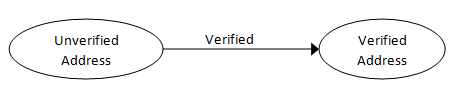
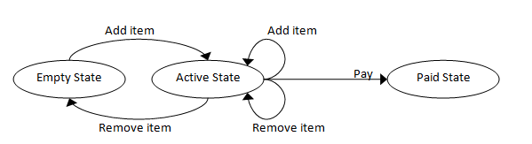
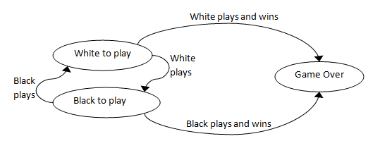
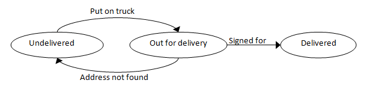
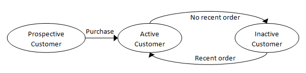

В этом посте мы познакомимся с тем, как с помощью конечных автоматов, делать неявные состояния явными; и с тем, как с помощью типов-объединений моделировать конечные автоматы.

## Небольшое введение в тему

В [одном из редыдущих постов](../designing-with-types-single-case-dus/) этого цикла мы взглянули на объединения с одним вариантом выбора, как на обёртки над такими значениями, как электронные адреса.

```fsharp
module EmailAddress =

    type T = EmailAddress of string

    let create (s:string) =
        if System.Text.RegularExpressions.Regex.IsMatch(s,@"^\S+@\S+\.\S+$")
            then Some (EmailAddress s)
            else None
```

Этот код предполагает, что адрес может быть либо правильным, либо неправильным.
И, если он неправильный, мы полностью его «забываем» и в качестве значения используем `None`.

Но у правильности бывают градации.
Что если нам надо сохранить неправильный электронный адрес вместо того, чтобы просто «забыть» его?
Обычно в таком случае мы можем задействовать систему типов и будем уверены, что не перепутаем правильный адрес с неправильным.

И снова на помощь нам приходит тип-объединение:

```fsharp
module EmailAddress =

    type T =
        | ValidEmailAddress of string
        | InvalidEmailAddress of string

    let create (s:string) =
        if System.Text.RegularExpressions.Regex.IsMatch(s,@"^\S+@\S+\.\S+$")
            then ValidEmailAddress s    // изменили тип результата
            else InvalidEmailAddress s  // изменили тип результата

    // проверяем
    let valid = create "abc@example.com"
    let invalid = create "example.com"
```

Теперь мы можем быть уверены, что письма уйдут только на проверенне адреса:

```fsharp
let sendMessageTo t =
    match t with
    | ValidEmailAddress email ->
         // отправить электронное письмо
    | InvalidEmailAddress _ ->
         // игнорировать
```

Пока всё идёт нормально.
Такой вид проектирования уже должен быть для вас очевидным.

> But this approach is more widely applicable than you might think.
> In many situations, there are similar "states" that are not made explicit, and handled with flags, enums, or conditional logic in code.

Но этот подход применим гораздо шире, чем можно представить.
В бизнес-логике могут быть спрятаны неявные «состояния», которые обрабатываются с помощью флагов, перечислений или условной логики в коде.

## Конечные автоматы

В примере выше «правильный» и «неправильный» варианты взаимно исключают друг друга.
Иными словами, правильный электронный адрес никогда не станет неправильным, и наоборот.

Но во многих случаях возможен переход от варианта к варианту из-за какого-то события.
Так у нас появляется идея [*конечного автомата*](http://en.wikipedia.org/wiki/Finite-state_machine).
В конечном автомате каждый вариант представляет «состояние», а движение из одного состояния к другому является «переходом».

(Примечание переводчика: В английском языке конечные автоматы называют *state machine*, из-за чего в русском языке можно встретить кальку *машина состояний*.
Возможно, сейчас калька используется даже чаще, чем оригинальный термин.)

Несколько примеров.

* Электронный адрес может иметь состояния «Непроверенный» и «Проверенный».
  Переход из «Непроверенного» состояния в «Проверенное» происходит, когда пользователь подтверждает электронный адрес, перейдя по ссылке.
  
* Корзина может иметь состояния «Пустая», «Активная» и «Оплаченная».
  Переход из «Пустого» состояния в «Активное», происходит при добавлении первого товара в корзину, а в «Оплаченное» — при оплате.
  
* В игре шахматы, могут быть состояния «Ход Белых», «Ход Чёрных» и «Игра Завершена».
  Переход от «Хода Белых» к «Ходу Чёрных» происходит после хода белых, а к состоянию «Игра Завершена» — после мата.
  

В каждом из этих примеров у нас есть состояния, множетсво переходов и события, которые приводят к переходам.
Конечные автоматы часто представляют в виде таблицы:


<table class="table table-condensed">
<thead>
<tr>
<th>Текущее состояние</th>
<th>Событие-></th>
<th>Добавить товар</th>
<th>Удалить товар</th>
<th>Заплатить</th>
</tr>
</thead>
<tbody>
<tr>
<th>Пустая</th>
<td></td>
<td>новое состояние = Активная</td>
<td>нет</td>
<td>нет</td>
</tr>
<tr>
<th>Активная</th>
<td></td>
<td>новое состояние = Активная</td>
<td>новое состояние = Активная или пустая,<br> в зависимости от количества товаров</td>
<td>новое состояние = Оплаченная</td>
</tr>
<tr>
<th>Оплаченная</th>
<td></td>
<td>нет</td>
<td>нет</td>
<td>нет</td>
</tr>
</tbody>
</table>


С помощью такой таблицы можно быстро разобраться, что должно произойти при каждом событии, когда система находится в заданном состоянии.

> 

## Зачем использовать конечные автоматы?

У конечных автоматом есть несколько преимуществ:

**Каждое состояние может иметь отличное от других допустимое поведение.**

В примере с проверкой электронной почты, может существовать бизнес-правило, которое гласит, что ссылку для сброса пароля можно отправлять только на проверенные адреса.
А в примере с корзиной — оплачивать можно только активную корзину, а в оплаченную корзину нельзя добавить товар.

**Все состояния явным образом документированы.**

В обычном коде часто скрыты важные, неявные и нигде не документированные состояния.

Скажем, «пустая корзина» имеет поведение, отличное от «активной корзины», но не часто это можно увидеть в коде в явном виде.

**Это инструмент проектирования, которые заставляет вас обдумывать все возможные варианты развития событий.**

Частой причиной ошибок являются забытые граничные условия, но конечный автомат заставляет продумывать все варианты.

Например, что случиться, если мы проверим уже проверенный адрес?
Что случится, если мы попытаемся удалить товар из пустой корзины?
Что случится, если белые попытаются сделать ход в состоянии «Ход Чёрных»?
И так далее.

## Как реализовать простой конечный автомат на F#

Возможно, вы знакомы со сложными конечными автоматами, похожими на те, которые используется в синтаксических анализаторах и регулярных выражениях.
Такие виды конечных автоматов генерируются из наборов правил или грамматик и их нельзя назвать простыми.

Те конечные автоматы, про которые я пишу — намного, намного проще.
Несколько вариантов, несколько переходов, и не нужны никакие сложные генераторы.

Каков же лучший способ реализовать простой конечный автомат?

Обычно каждое состояние имеет свой собственный тип, чтобы хранить данные, относящиеся к этому состоянию (если есть), и тогда всё множество состояний будет представлено типом-объединением.

Вот пример представления состояния корзины.

```fsharp
type ActiveCartData = { UnpaidItems: string list }
type PaidCartData = { PaidItems: string list; Payment: float }

type ShoppingCart =
    | EmptyCart  // нет данных
    | ActiveCart of ActiveCartData
    | PaidCart of PaidCartData
```

Обратите внимание, что у состояния `EmptyCart` («Пустая») нет данных, поэтому для него не нужно описывать отдельный тип.

Каждое событие представлено функцией, которая принимает конечный автомат целиком (тип-объединение) и возвращает новую версию конечного автомата (снова, тип-объединение).

Вот пример реализации двух событий корзины:

```fsharp
let addItem cart item =
    match cart with
    | EmptyCart ->
        // создать новую активную корзину с одним товаром
        ActiveCart {UnpaidItems=[item]}
    | ActiveCart {UnpaidItems=existingItems} ->
        // создать новую активную карту с ещё одним товаром
        ActiveCart {UnpaidItems = item :: existingItems}
    | PaidCart _ ->
        // игнорировать
        cart

let makePayment cart payment =
    match cart with
    | EmptyCart ->
        // игнорировать
        cart
    | ActiveCart {UnpaidItems=existingItems} ->
        // создать оплаченную карту с платежом
        PaidCart {PaidItems = existingItems; Payment=payment}
    | PaidCart _ ->
        // игнорировать
        cart
```

С точки зрения вызывающей функции, множество состояний рассматривается как «единое целое» — значение типа `ShoppingCart`.
Но при обработке событий внутри каждое состояние обрабатывается отдельно.

### Проектирование функций обработки событий

Правило: *Каждая функция обработки события должна принимать и возвращать конечный автомат целиком*

Вы можете спросить: зачем передавать в функции-обработчики всю корзину?
Скажем, событие `makePayment` имеет смысл только тогда, когда корзина находится в активном состоянии, так почему бы явно не передать ему тип `ActiveCart`:

```fsharp
let makePayment2 activeCart payment =
    let {UnpaidItems=existingItems} = activeCart
    {PaidItems = existingItems; Payment=payment}
```

Сравним сигнатуры функций:

```fsharp
// оригинальная функция
val makePayment : ShoppingCart -> float -> ShoppingCart

// новая более конкретная функция
val makePayment2 :  ActiveCartData -> float -> PaidCartData
```

Оригинальная функция `makePayment` принимает корзину и возвращает корзину, в то время как новая функция принимает `ActiveCartData`, а возвращает `PaidCartData`, что кажется более уместным.

Но как бы вы обрабатывали то же событие для корзины в пустом или оплаченном состоянии?
Кто-то должен обрабатывать событие для всех возможных состояний.
Лучше инкапсулировать эту бизнес-логику внутри функции, чем надеяться, что это сделает вызывающая сторона.

### Работа с «сырыми» состояниями

Иногда важно трактовать одно из состояний как самостоятельную сущность и использовать независимо.
Это несложно, учитывая, что каждое состояние — это тип.

Скажем, если мне нужно отчитаться о всех оплаченных корзинах, я могу передать в функцию список записей `PaidCartData`.

```fsharp
let paymentReport paidCarts =
    let printOneLine {Payment=payment} =
        printfn "Paid %f for items" payment
    paidCarts |> List.iter printOneLine
```

Используя список `PaidCartData` вместо `ShoppointCart`, я могу быть уверен, что случайно не включу в отчёт неоплаченные корзины.

Такая функция должна быть вспомогательной по отношению к обработчику события, а не самим обработчиком.

> 

## Используем явные состояния вместо булевых флагов

Как применить этот подход в нашем случае?

В [первом посте](/../designing-with-types-intro/) у нас был флаг-индикатор, что заказчик подтвердил свой электронный адрес.

```fsharp
type EmailContactInfo =
    {
    EmailAddress: EmailAddress.T;
    IsEmailVerified: bool;
    }
```

Всякий раз, когда вы видите подобный флаг, вы, скорее всего, имеете дело с состоянием.
В данном случае булево значение показывает, что у нас есть состояния «Непроверена» и «Проверена».

Скорее всего у каждого состояния будут свои бизнес-правила.
Вот, например, два:

* Бизнес-правило: *«Подтверждающие письма должны отсылаться только заказчикам с неподтверждёнными электронными адресами»*
* Бизнес-правило: *«Письма с ссылкой на сброс пароля должны отсылаться только заказчикам с подтверждёнными электронными адресами»*

Как и раньше, мы можем использовать типы, чтобы обеспечить соответствие кода этим правилам.

Давайте перепишем тип `EmailContactInfo`, используя конечный автомат.
Кроме того, перенесём его в модуль.

Начнём с определения двух новых состояний.

* Для состояния «Непроверенный», единственные данные, которые надо сохранить — это электронный адрес.
* Для состояния «Проверенный» мы можем хранить дополнительные данные: дату проверки, количество запросов на сброс пароля и т. д.
  Эти данные не подходят (и не должны быть доступны) для состояния «Непроверенный».

```fsharp
module EmailContactInfo =
    open System

    // заглушка
    type EmailAddress = string

    // UnverifiedData = просто электронный адрес
    type UnverifiedData = EmailAddress

    // VerifiedData = электронный адрес плюс дата проверки
    type VerifiedData = EmailAddress * DateTime

    // множество состояний
    type T =
        | UnverifiedState of UnverifiedData
        | VerifiedState of VerifiedData

```

Обратите внимание, что для `UnverifiedData` я просто использовал псевдоним типа.
Сейчас не требуется ничего более сложного, а псевдонимы делают наше намерение явным и помогает с рефакторингом.

Теперь займёмся конструированием нового конечного автомата и событиями.

* Конструирование *всегда* возвращает непроверенный электронный адрес.
  Это просто.
* Есть всего одно событие «проверен», которое переводит автомат в новое состояние.

```fsharp
module EmailContactInfo =

    // типы как выше

    let create email =
        // непроверенное при создании
        UnverifiedState email

    // обработать событие "проверен"
    let verified emailContactInfo dateVerified =
        match emailContactInfo with
        | UnverifiedState email ->
            // создать новый объект в состоянии Проверенный
            VerifiedState (email, dateVerified)
        | VerifiedState _ ->
            // игнорировать
            emailContactInfo
```

[Мы уже обсуждали](/../match-expression/), что каждая ветка `match` должна возвращать один и тот же тип.
Это значит, что, игнорируя проверенное состояние, мы всё ещё должны что-нибудь вернуть, например тот же объект, который мы получили на вход.

Наконец, напишем вспомогательные функции `sendVerificationEmail` и `sendPasswordReset`.

```fsharp
module EmailContactInfo =

    // типы и функции как выше

    let sendVerificationEmail emailContactInfo =
        match emailContactInfo with
        | UnverifiedState email ->
            // отправить электронное письмо
            printfn "отправка электронного письма"
        | VerifiedState _ ->
            // ничего не делать
            ()

    let sendPasswordReset emailContactInfo =
        match emailContactInfo with
        | UnverifiedState email ->
            // игнорировать
            ()
        | VerifiedState _ ->
            // запросить сброс пароля
            printfn "запрос сброса пароля"
```

> 

## Используем явные варианты вместо операторов `case`/`switch`

Если состояний больше двух, в языках C# и Java вместо `bool` используют типы `int` или `enum`.

Вот, например, простая диаграмма состояний для статусов в системе доставки, где посылка имеет три возможных состояния:



Из этой диаграммы вытекают несколько очевидных бизнес-правил:

* *Правило: «Нельзя отправить посылку, если она уже отправлена»*
* *Правило: «Нельзя расписаться за посылку, которая уже доставлена»*

и так далее.

Эти состояния можно описать без использования типов-объединений, с помощью перечисления (`enum`):

```fsharp
open System

type PackageStatus =
    | Undelivered
    | OutForDelivery
    | Delivered

type Package =
    {
    PackageId: int;
    PackageStatus: PackageStatus;
    DeliveryDate: DateTime;
    DeliverySignature: string;
    }
```

Код обработки событий «отправить» и «расписаться» может выглядеть так:

```fsharp
let putOnTruck package =
    {package with PackageStatus=OutForDelivery}

let signedFor package signature =
    let {PackageStatus=packageStatus} = package
    if (packageStatus = Undelivered)
    then
        failwith "посылка не отправлена (package not out for delivery)"
    else if (packageStatus = OutForDelivery)
    then
        {package with
            PackageStatus=OutForDelivery;
            DeliveryDate = DateTime.UtcNow;
            DeliverySignature=signature;
            }
    else
        failwith "посылка уже доставлена (package already delivered)"
```

В этом коде есть пара незначительных ошибок.

* Как быть, если при обработке события «отправить», статус посылки — уже `OutForDelivery` (в доставке) или `Delivered` (доставлена)?
  В коде ничего про это не сказано.
* При обработке события «расписаться» мы обрабатываем все состояния, но последняя ветка `else` подразумевает, что у нас только три состояния, и не проверяет состояние явным образом.
  Этот код станет неправильным, если нам потребуется новый статус.
* Наконец, из-за того, что `DeliveryDate` и `DeliverySignature` описаны в основной структуре, им случайно можно присвоить значения, даже если посылка не перешла в статус `Delivered`.

Как обычно, идиоматичный и типо-безопасный подход F# заключается в том, чтобы вместо встраивания статуса в структуру данных, использовать большой тип-объединение.

```fsharp
open System

type UndeliveredData =
    {
    PackageId: int;
    }

type OutForDeliveryData =
    {
    PackageId: int;
    }

type DeliveredData =
    {
    PackageId: int;
    DeliveryDate: DateTime;
    DeliverySignature: string;
    }

type Package =
    | Undelivered of UndeliveredData
    | OutForDelivery of OutForDeliveryData
    | Delivered of DeliveredData
```

Теперь обработчики событий *должны* обработать каждый вариант.

```fsharp
let putOnTruck package =
    match package with
    | Undelivered {PackageId=id} ->
        OutForDelivery {PackageId=id}
    | OutForDelivery _ ->
        failwith "посылка уже отправлена (package already out)"
    | Delivered _ ->
        failwith "послыка уже доставлена (package already delivered)"

let signedFor package signature =
    match package with
    | Undelivered _ ->
        failwith "послыка не отправлена (package not out)"
    | OutForDelivery {PackageId=id} ->
        Delivered {
            PackageId=id;
            DeliveryDate = DateTime.UtcNow;
            DeliverySignature=signature;
            }
    | Delivered _ ->
        failwith "послыка уже доставлена (package already delivered)"
```

*Обратите внимание: я использую `failWith` для обработки ошибок.*
*В промышленных системах этот код надо заменить на клиентские обработчики ошибок.*
*Некоторые идеи см. в обсуждении обработки ошибок в [посте о размеченных объединениях с одним вариантом](/../designing-with-types-single-case-dus/).*

## Используем явные варианты вместо неявного условного кода

Наконец, бывает, что у системы есть состояния, неявно представленные в условном коде.

Вот, например, тип, который представляет заказ.

```fsharp
open System

type Order =
    {
    OrderId: int;
    PlacedDate: DateTime;
    PaidDate: DateTime option;
    PaidAmount: float option;
    ShippedDate: DateTime option;
    ShippingMethod: string option;
    ReturnedDate: DateTime option;
    ReturnedReason: string option;
    }
```

Вы можете догадаться, что заказы бывают «новыми», «оплаченными», «отправленными» и «возвращёнными», иметь дату/время и другую информацию для каждого перехода, но всё это не описано в коде в явном виде.

Опциональные значения подсказывают, что этот тип пытается взять на себя слишком много.
Но, по крайней мере, F# заставляет вас использовать опциональные типы.
В C# или Java это были бы значения `null` и, глядя на описание, вы бы не знали, обязательны они или нет.

Взглянем на уродливый код, который проверяет опциональные значения, чтобы узнать, в каком состоянии находится заказ.

В коде есть бизнес логика, которая зависит от состояния заказа, но нигде в явном виде не описано, какими бывают состояния и переходы.

```fsharp
let makePayment order payment =
    if (order.PaidDate.IsSome)
    then failwith "заказ уже оплачен (order is already paid)"
    //вернуть обновлённый заказ с информацией об оплате
    {order with
        PaidDate=Some DateTime.UtcNow
        PaidAmount=Some payment
        }

let shipOrder order shippingMethod =
    if (order.ShippedDate.IsSome)
    then failwith "заказ уже отправлен (order is already shipped)"
    //вернуть обновлённый заказ с информацией об отправке
    {order with
        ShippedDate=Some DateTime.UtcNow
        ShippingMethod=Some shippingMethod
        }
```

*Обратите внимание: чтобы проверить наличие опционального значения, я использую `IsSome` потому что это похоже на проверку на `null` в C#. Но `IsSome` одновременно и уродлив, и опасен. Не используйте его!*

Вот лучший подход, в котором состояния описаны явно:

```fsharp
open System

type InitialOrderData =
    {
    OrderId: int;
    PlacedDate: DateTime;
    }
type PaidOrderData =
    {
    Date: DateTime;
    Amount: float;
    }
type ShippedOrderData =
    {
    Date: DateTime;
    Method: string;
    }
type ReturnedOrderData =
    {
    Date: DateTime;
    Reason: string;
    }

type Order =
    | Unpaid of InitialOrderData
    | Paid of InitialOrderData * PaidOrderData
    | Shipped of InitialOrderData * PaidOrderData * ShippedOrderData
    | Returned of InitialOrderData * PaidOrderData * ShippedOrderData * ReturnedOrderData
```

А вот методы обработки событий.

```fsharp
let makePayment order payment =
    match order with
    | Unpaid i ->
        let p = {Date=DateTime.UtcNow; Amount=payment}
        // возвращаем оплаченный заказ
        Paid (i,p)
    | _ ->
        printfn "заказ уже оплачен (order is already paid)"
        order

let shipOrder order shippingMethod =
    match order with
    | Paid (i,p) ->
        let s = {Date=DateTime.UtcNow; Method=shippingMethod}
        // возвращаем отправленный заказ
        Shipped (i,p,s)
    | Unpaid _ ->
        printfn "заказ ещё не оплачен (order is not paid for)"
        order
    | _ ->
        printfn "заказ уже отправлен (order is already shipped)"
        order
```

*Обратие внимание: для обработки ошибок я использую `printfn`. В промышленных системах применяют другие подходы.*

## Когда не надо использовать этот подход

Часто, изучая новую технику, мы начинаем применять её, как [золотой молоток](https://ru.wikipedia.org/wiki/%D0%97%D0%BE%D0%BB%D0%BE%D1%82%D0%BE%D0%B9_%D0%BC%D0%BE%D0%BB%D0%BE%D1%82%D0%BE%D0%BA).

Конечные автоматы добавляют сложность в вашу программу.
Перед тем как их использовать, убедитесь, что плюсы перевешивают минусы.

Вот несколько условий, когда простые конечные автоматы быть выгодны:

* У вас есть взаимоисключающие состояния с переходами между ними.
* Переходы вызываются внешними событиями.
* Перечень состояний исчерпывающий.
  Других возможностей нет и вы должны обрабатывать все варианты.
* У каждого состояния могут быть связанные данные, недоступные, когда система находится в другом состоянии.
* Есть неизменные бизнес-правила, которые применяются к состояниям.

Рассмотрим несколько примеров, где эти рекомендации *не* применимы.

**Состояния не важны для предметной области**

Представим приложение для ведения блога.
Пост в блоге может находиться в состояниях «Черновик», «Опубликован» и т. д.
Есть очевидные переходы между состояниями, зависящие от событий, например, от нажатия кнопки «Опубликовать».

Но стоит ли ради этого создавать конечный автомат?
Я бы сказал, что нет.

Да, есть переходы между состояниями, но действительно ли из-за этого появляется другая логика?
С точки зрения автора, нет никаких ограничений, основанных на состоянии.
Вы можете править черновик точно также, как вы правите опубликованный пост.

Единственная часть системы, которой *есть* дело до стояния — метод отображения постов.
Он отфильтровывает черновики на уровне базы данных ещё до того, как они попадут на уровень предметной области.

Поскольку нет особой бизнес-логики, основанной на состояниях, они, вероятно, и не нужны.

**Переходы между состояниями возникают вне приложения**

В приложениях по управлению клиентами, принято классифицировать клиентов как «потенциальных», «активных», «неактивных» и т. д.



Эти состояния имеют смысл с точки зрения бизнес-логики и должны быть представлены в системе типов (например, как тип-объединение).
Но *переходы* между состояниями не возникают непосредственно в приложении.
Скажем, мы можем считать клиента неактивным, если он ничего не покупал в течение полугода.
Это правило может быть применено к записи клиента в базе данных в еженочно выполняемом скрипте, или когда запись клиента загружается из базы данных.
Но, с точки зрения приложения, переход происходят *снаружи*, так что мы не должны создавать специальный конечный автомат.

**Изменяемые бизнес-правила**

Последний пункт в списке относится к «неизменным» бизнес-правилам.
Под «неизменными» я подразумеваю, что правила изменяются достаточно редко, чтобы их можно было зафиксировать прямо в коде.

Если правила динамичные и часто меняются, нет смысла тратить время на создание статических типов.

Стоит рассмотреть активные шаблоны или даже полноценный движок для правил.

## Заключение

> In this post, we've seen that if you have data structures with explicit flags ("IsVerified") or status fields ("OrderStatus"), or implicit state (clued by an excessive number of nullable or option types), it is worth considering using a simple state machine to model the domain objects.
> In most cases the extra complexity is compensated for by the explicit documentation of the states and the elimination of errors due to not handling all possible cases.

В этом посте мы увидели, что если у вас есть явные флаги (`IsVerified`), или статусы (`OrderStatus`), или неявные состояниями со многими опциональными значениями, стоит рассмотреть простой конечный автомат для моделирования предметной области.
Дополнительная сложность компенсируется явным документированием состояний и исчезновением ошибок, возникающих из-за пропуска возможных вариантов.
