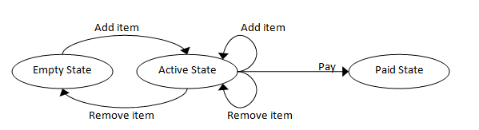
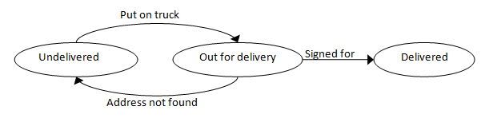

> In this post we will look at making implicit states explicit by using state machines, and then modelling these state machines with union types.

В этом посте мы познакомимся с тем, как сделать неявные состояния явными с помощью конечных автоматов (машин состояния), с последующим моделированием этих конечных автоматов с помощью типов-объединений.

> ## Background ##

## Небольшое введение в тему

> In an [earlier post](/posts/designing-with-types-single-case-dus/) in this series, we looked at single case unions as a wrapper for types such as email addresses.

В [одном из редыдущих постов](../designing-with-types-single-case-dus/) этого цикла мы взглянули на объединения с одним вариантом выбора, как на обёртки над такими типами, как электронные адреса.

```fsharp
module EmailAddress =

    type T = EmailAddress of string

    let create (s:string) =
        if System.Text.RegularExpressions.Regex.IsMatch(s,@"^\S+@\S+\.\S+$")
            then Some (EmailAddress s)
            else None
```

> This code assumes that either an address is valid or it is not.
> If it is not, we reject it altogether and return `None` instead of a valid value.

Этот код предполагает, что адрес может быть либо правильным, либо неправильным.
И если он неправильный, мы полностью его отвергаем и используем `None` вместо корректного значения.

> But there are degrees of validity.
> For example, what happens if we want to keep an invalid email address around rather than just rejecting it?
> In this case, as usual, we want to use the type system to make sure that we don't get a valid address mixed up with an invalid address.

Но у правильности бывают градации.
Например, что если нам надо сохранить неправильный электронный адрес вместо того, чтобы просто отвергнуть его?
В этом случае обычно мы хотим использовать систему типов, чтобы быть уверенными, что мы не перепутмаем правильный адрес с неправильным.

> The obvious way to do this is with a union type:

Очевидный способ сделать это заключается в использовании типа-объединения:

```fsharp
module EmailAddress =

    type T =
        | ValidEmailAddress of string
        | InvalidEmailAddress of string

    let create (s:string) =
        if System.Text.RegularExpressions.Regex.IsMatch(s,@"^\S+@\S+\.\S+$")
            then ValidEmailAddress s    // изменили тип результата (change result type)
            else InvalidEmailAddress s  // изменили тип результата (change result type)

    // test
    // проверяем
    let valid = create "abc@example.com"
    let invalid = create "example.com"
```

> and with these types we can ensure that only valid emails get sent:

и с помощью этих типов мы можем быть уверенными, что письма уйдут только на проверенне адреса:

```fsharp
let sendMessageTo t =
    match t with
    | ValidEmailAddress email ->
         // отправить электронное письмо (send email)
    | InvalidEmailAddress _ ->
         // игнорировать (ignore)
```

> So far, so good.
> This kind of design should be obvious to you by now.

Пока всё идёт нормально.
Такой вид проектирования уже должен быть для вас очевидным.

> But this approach is more widely applicable than you might think.
> In many situations, there are similar "states" that are not made explicit, and handled with flags, enums, or conditional logic in code.

Но этот подход применим гораздо шире, чем вы могли бы подумать.
Во многих ситуациях, существуют «состояния», которые не сделаны явными, и обрабатываются с помощью флагов, перечислений или условной логики в коде.

> ## State machines ##

## Конечные автоматы

> In the example above, the "valid" and "invalid" cases are mutually incompatible.
> That is, a valid email can never become invalid, and vice versa.

В примере выже, «правильный» и «неправильный» варианты взаимно исключают друг друга.
То есть, правильный электронный адрес никогда не станет неправильным, и наоборот.

> But in many cases, it is possible to go from one case to another, triggered by some kind of event.
> At which point we have a ["state machine"](http://en.wikipedia.org/wiki/Finite-state_machine), where each case represents a "state", and moving from one state to another is a "transition".

Но во многих случаях возможен переход от одного варианта к другому, вызванный каким-то событием.
Здесь у нас появляется [«конечный автомат»](http://en.wikipedia.org/wiki/Finite-state_machine), где каждый вариант представляет «состояние», а движение из одного состояния к другому является «переходом».

<!-- Традиционно, у нас эта штука называется конечным автоматом:
https://ru.wikipedia.org/wiki/%D0%9A%D0%BE%D0%BD%D0%B5%D1%87%D0%BD%D1%8B%D0%B9_%D0%B0%D0%B2%D1%82%D0%BE%D0%BC%D0%B0%D1%82
Но прямой перевод "машина состояний" тоже встречается. Думаю, об этом надо просто оставить примечание.
 -->

> Some examples:

Несколько примеров.

> * A email address might have states "Unverified" and "Verified", where you can transition from the "Unverified" state to the "Verified" state by asking the user to click on a link in a confirmation email.
> 
> * A shopping cart might have states "Empty", "Active" and "Paid", where you can transition from the "Empty" state to the "Active" state by adding an item to the cart, and to the "Paid" state by paying.
> 
> * A game such as chess might have states "WhiteToPlay", "BlackToPlay" and "GameOver", where you can transition from the "WhiteToPlay" state to the "BlackToPlay" state by White making a non-game-ending move, or transition to > the "GameOver" state by playing a checkmate move.
> 

* Электронный адрес может иметь состояния «Непроверенный» и «Проверенный», где вы можете перейти из «Непроверенного» состояния в «Проверенное», попросив у пользователя перейти по ссылке для подтверждения электронного адреса.
  
* Корзина может иметь состояния «Пустая», «Активная» и «Оплаченная», где вы можете перейти из «Пустого» в «Активное» состояние, добавив товар в корзину, и в «Оплаченное» состояние, заплатив.
> 
* Такая игра, как шахматы, может иметь состояния «Ход Белых», «Ход Чёрных» и «Игра Завершена», где вы можете перейти из состояния «Ход Белых» в состояние «Ход Чёрных», сделав обычный ход белыми, или перейти в состояние «Игра Завершена», поставив мат.
> 

> In each of these cases, we have a set of states, a set of transitions, and events that can trigger a transition.
> State machines are often represented by a table, like this one for a shopping cart:

В каждом из этих случаев у нас есть состояния, множетсво переходов и события, которые приводят к переходам.
Конечные автоматы часто представляют в виде таблицы, наподобие такой для корзины:

> 
> <table class="table table-condensed">
> <thead>
> <tr>
> <th>Current State</th>
> <th>Event-></th>
> <th>Add Item</th>
> <th>Remove Item</th>
> <th>Pay</th>
> </tr>
> </thead>
> <tbody>
> <tr>
> <th>Empty</th>
> <td></td>
> <td>new state = Active</td>
> <td>n/a</td>
> <td>n/a</td>
> </tr>
> <tr>
> <th>Active</th>
> <td></td>
> <td>new state = Active</td>
> <td>new state = Active or Empty,<br> depending on the number of items</td>
> <td>new state = Paid</td>
> </tr>
> <tr>
> <th>Paid</th>
> <td></td>
> <td>n/a</td>
> <td>n/a</td>
> <td>n/a</td>
> </tr>
> </tbody>
> </table>
> 


<table class="table table-condensed">
<thead>
<tr>
<th>Текущее состояние</th>
<th>Событие-></th>
<th>Добавить товар</th>
<th>Удалить товар</th>
<th>Заплатить</th>
</tr>
</thead>
<tbody>
<tr>
<th>Пустая</th>
<td></td>
<td>новое состояние = Активная</td>
<td>нет</td>
<td>нет</td>
</tr>
<tr>
<th>Активная</th>
<td></td>
<td>новое состояние = Активная</td>
<td>новое состояние = Активная или пустая,<br> в зависимости от количества товаров</td>
<td>новое состояние = Оплаченная</td>
</tr>
<tr>
<th>Оплаченная</th>
<td></td>
<td>нет</td>
<td>нет</td>
<td>нет</td>
</tr>
</tbody>
</table>


> With a table like this, you can quickly see exactly what should happen for each event when the system is in a given state.

С такой таблицей, как это, вы быстро можете увидеть что точно должно произвойти для каждого события, когда система находится в заданном состоянии.

> 

## Why use state machines?

## Зачем использовать конечные автоматы?

> There are a number of benefits to using state machines in these cases:

Есть несколько преимуществ использования конечных автоматов в таких случаях:

> **Each state can have different allowable behavior.**

**Каждое состояние может иметь отличное от других допустимое поведение.**

> In the verified email example, there is probably a business rule that says that you can only send password resets to verified email addresses, not to unverified addresses.
> And in the shopping cart example, only an active cart can be paid for, and a paid cart cannot be added to.

В примере с провкой электронной почты, может существовать бизнес-правило, которое гласит, что вы можете послать ссылку для сброса пароля только на проверенные электронные адреса, а не на непроверенные адреса.
А в примере с корзиной, только активная корзина может быть оплачена, а в оплаченную корзину нельзя добавить товар.

> **All the states are explicitly documented.**

**Все состояния явным образом документированы.**

> It is all too easy to have important states that are implicit but never documented.

Слишком легко получить важные неявные состояния, которые нигде не документированы.

> For example, the "empty cart" has different behavior from the "active cart" but it would be rare to see this documented explicitly in code.

Напримир, «пустая корзина» имеет поведение, отличное от «активной корзины», но редко можно это увидеть явным образом документированное в коде.

> **It is a design tool that forces you to think about every possibility that could occur.**

**Это инструмент проектирования, которые заставляет вас обдумывать все возможные варианты развития событий.**

> A common cause of errors is that certain edge cases are not handled, but a state machine forces all cases to be thought about.

Частой причиной ошибок является то, что не обрабатываются определённые граничные случаи <!-- условия -->, но конечный автомат заставляет продумать все варианты.

> For example, what should happen if we try to verify an already verified email?
> What happens if we try to remove an item from an empty shopping cart?
> What happens if white tries to play when the state is "BlackToPlay"?
> And so on.

Например, что должно случиться, если мы попытаемся проверить уже проверенный электронный адрес?
Что случится, если мы попытаемся удалить товар из пустой корзины?
Что случится, если белые попытаются сделать ход в состоянии «Ход Чёрных»?
И так далее.

> ## How to implement simple state machines in F# ##

## Как реализовать простой конечный автомат на F#

> You are probably familiar with complex state machines, such as those used in language parsers and regular expressions.
> Those kinds of state machines are generated from rule sets or grammars, and are quite complicated.

Возможно, вы знакомы со сложными конечными автоматами, подобными тем, которые используется в синтаксических анализаторах и регулярных выражениях.
Такие виды конечных автоматов генерируются из наборов правил или грамматик и достаточно сложные.

> The kinds of state machines that I'm talking about are much, much simpler.
> Just a few cases at the most, with a small number of transitions, so we don't need to use complex generators.

Виды конечных автоматов, про которые я говорю — намного, намного проще.
В целом, всего лишь несколько вариантов, с небольшим количеством переходов, там что нам не нужно использовать сложные генераторы.

> So what is the best way implement these simple state machines?

Так каков лучший способ реализовать эти простые конечные автоматы?

> Typically, each state will have its own type, to store the data that is relevant to that state (if any), and then the entire set of states will be represented by a union class.

Обычно, каждое состояние имеет свой собственный тип, чтобы хранить данные, относящиеся к этому состоянию (если есть), и тогда всё множество состояний будет представлено типом-объединением. <!-- думаю, что всё-таки не "классом", а "типом" -->

> Here's an example using the shopping cart state machine:

Вот пример использования конечного автомата корзины.

```fsharp
type ActiveCartData = { UnpaidItems: string list }
type PaidCartData = { PaidItems: string list; Payment: float }

type ShoppingCart =
    | EmptyCart  // no data
    | ActiveCart of ActiveCartData
    | PaidCart of PaidCartData
```

> Note that the `EmptyCart` state has no data, so no special type is needed.

Обратите внимание, что у состояния <!-- Пустая карта --> `EmptyCart` данных нет, так что никакой особый <!-- дополнительный, отдельный --> тип не нужен.

> Each event is then represented by a function that accepts the entire state machine (the union type) and returns a new version of the state machine (again, the union type).

Затем, каждое событие представлено функцией, которая принимает конечный автомат целиком (тип-объединение) и возвращает новую версию конечного автомата (снова, тип-объединение).

> Here's an example using two of the shopping cart events:

Вот пример использования двух событий корзины:

```fsharp
let addItem cart item =
    match cart with
    | EmptyCart ->
        // создать новую активную корзину с одним товаром (create a new active cart with one item)
        ActiveCart {UnpaidItems=[item]}
    | ActiveCart {UnpaidItems=existingItems} ->
        // создать новую активную карту с ещё одним товаром (create a new ActiveCart with the item added)
        ActiveCart {UnpaidItems = item :: existingItems}
    | PaidCart _ ->
        // игнорировать (ignore)
        cart

let makePayment cart payment =
    match cart with
    | EmptyCart ->
        // игнорировать (ignore)
        cart
    | ActiveCart {UnpaidItems=existingItems} ->
        // создать оплаченную карту с платежом (create a new PaidCart with the payment)
        PaidCart {PaidItems = existingItems; Payment=payment}
    | PaidCart _ ->
        // игнорировать (ignore)
        cart
```

> You can see that from the caller's point of view, the set of states is treated as "one thing" for general manipulation (the `ShoppingCart` type), but when processing the events internally, each state is treated separately.

Вы можете видеть, что с точки зрения вызывающей функции, множество состояний рассматривается как «единое целое» для разного рода изменений (типа `ShoppingCart`), но при обработке событий внутри, каждое состояние обрабатывается отдельно.

> ### Designing event handling functions

### Проектирование функций обработки событий

> Guideline: *Event handling functions should always accept and return the entire state machine*

Правило: *Каждая функция обработки события должна принимать и возвращать конечный автомат целиком*

> You might ask: why do we have to pass in the whole shopping cart to the event-handling functions?
> For example, the `makePayment` event only has relevance when the cart is in the Active state, so why not just explicitly pass it the ActiveCart type, like this:

Вы можете спросить: почему мы должны передавать в функции обработки событий корзину целиком?
Например, событие `makePayment` имеет смысл только тогда, когда корзина находится в активном состоянии, так почему бы явно не передать ему тип `ActiveCart`, как здесь:

```fsharp
let makePayment2 activeCart payment =
    let {UnpaidItems=existingItems} = activeCart
    {PaidItems = existingItems; Payment=payment}
```

> Let's compare the function signatures:

Давайте сравним сигнатуры функций:

```fsharp
// the original function
// оригинальная функция
val makePayment : ShoppingCart -> float -> ShoppingCart

// the new more specific function
// новая более конкретная функция
val makePayment2 :  ActiveCartData -> float -> PaidCartData
```

> You will see that the original `makePayment` function takes a cart and results in a cart, while the new function takes an `ActiveCartData` and results in a `PaidCartData`, which seems to be much more relevant.

Вы увидите, что оригинальная функция `makePayment` принимает корзину и возвращает корзину, в то время как новая функция принимает `ActiveCartData`, а возвращает `PaidCartData`, что кажется гораздо более уместным.

> But if you did this, how would you handle the same event when the cart was in a different state, such as empty or paid?
> Someone has to handle the event for all three possible states somewhere, and it is much better to encapsulate this business logic inside the function than to be at the mercy of the caller.

Но, если бы вы сделали это, как бы вы обрабатывали то же событие, если бы корзина была в другом состоянии, пустом или оплаченном?
Кому-то нужно обрабатывать событие для всех трёх возможных состояний где-то, и гораздо лучше инкапсулировать эту бизнес-логику внутри функции, чем зависеть от милости вызывающей стороны.

> ### Working with "raw" states

### Работа с «сырыми» состояниями

> Occasionally you do genuinely need to treat one of the states as a separate entity in its own right and use it independently.
> Because each state is a type as well, this is normally straightforward.

Иногда вам действительно нужно трактовать одно из состояний как отдельную самостоятельную сущность и использовать её независимо.
Из-за того, что каждое состояние также является типом, это, обычно, просто.

> For example, if I need to report on all paid carts, I can pass it a list of `PaidCartData`.

Например, елси мне нужно отчитаться о всех оплаченных корзинах, я могу передать в функцию список <!-- объектов, записей --> `PaidCartData`.

```fsharp
let paymentReport paidCarts =
    let printOneLine {Payment=payment} =
        printfn "Paid %f for items" payment
    paidCarts |> List.iter printOneLine
```

> By using a list of `PaidCartData` as the parameter rather than `ShoppingCart` itself, I ensure that I cannot accidentally report on unpaid carts.

Используя список `PaidCartData` в качестве параметра вместо непосредственно `ShoppointCart`, я могу быть уверен, что не включу случайнов в отчёт неоплаченные корзины.

> If you do this, it should be in a supporting function to the event handlers, never the event handlers themselves.

Если вы так делаете, то это должна быть функция, вспомогательная по отношению к обработчикам событий, а не сами обработчики событий.

> 

> ## Using explicit states to replace boolean flags ##

## Использование явных состояний для замены булевых флагов

> Let's look at how we can apply this approach to a real example now.

Теперь давайте посмотрим, как мы можем применить этот подход к реальному примеру.

> In the `Contact` example from an [earlier post](/posts/designing-with-types-intro/) we had a flag that was used to indicate whether a customer had verified their email address.
> The type looked like this:

В примере с `Contact` из [первого поста](/../designing-with-types-intro/) у нас был флаг, который использовался для подтверждения, что заказчик подтвердил <!-- тавтология, надо поискать варианты --> свой электронный адрес.

```fsharp
type EmailContactInfo =
    {
    EmailAddress: EmailAddress.T;
    IsEmailVerified: bool;
    }
```

> Any time you see a flag like this, chances are you are dealing with state.
> In this case, the boolean is used to indicate that we have two states: "Unverified" and "Verified".

Всякий раз, когда вы видите подобный флаг, скорее всего, вы имеете дело с состоянием.
В данном случае булево значение используется, чтобы показать, что у нас есть два состояния: «Непроверена» и «Проверена».

> As mentioned above, there will probably be various business rules associated with what is permissible in each state.
> For example, here are two:

Как упоминалось выше, вероятно, будут существовать различные бизнес-правила, связанные с тем, что разрешено в каждом состоянии.
Вот, например, два:

> * Business rule: *"Verification emails should only be sent to customers who have unverified email addresses"*
> * Business rule: *"Password reset emails should only be sent to customers who have verified email addresses"*

* Бизнес-правило: *«Подтверждающие письма должны отсылаться только заказчикам с неподтверждёнными электронными адресами»*
* Бизнес-правило: *«Письма с ссылкой на сброс пароля должны отсылаться только заказчикам с подтверждёнными электронными адресами»*

> As before, we can use types to ensure that code conforms to these rules.

Как и раньше мы можем исользовать типы, чтобы обеспечить соответствие кода этим правилам.

> Let's rewrite the `EmailContactInfo` type using a state machine.
> We'll put it in an module as well.

Давайте перепишем тип `EmailContactInfo`, используя конечный автомат.
Кроме того, поместим его в модуль.

> We'll start by defining the two states.

Начнём с определения двух новых состояний.

> * For the "Unverified" state, the only data we need to keep is the email address.
> * For the "Verified" state, we might want to keep some extra data in addition to the email address, such as the date it was verified, the number of recent password resets, on so on.
>   This data is not relevant (and should not even be visible) to the "Unverified" state.

* Для состояния «Непроверенный», единственные данные, которые нам надо сохранить — это электронный адрес.
* Для состояния «Проверенный» мы можем заходить сохранить дополнительные данные в дополнитение к электронному адресу, такие как дата проверки, количество недавних запросов на сброс пароля и т. д.
  Эти данные не подходят (и не должны быть доступны) для состояния «Непроверенный».

```fsharp
module EmailContactInfo =
    open System

    // placeholder
    // заглушка
    type EmailAddress = string

    // UnverifiedData = just the email
    // UnverifiedData = просто электронный адрес
    type UnverifiedData = EmailAddress

    // VerifiedData = email plus the time it was verified
    // VerifiedData = электронный адрес плюс дата проверки
    type VerifiedData = EmailAddress * DateTime

    // set of states
    // множество состояний
    type T =
        | UnverifiedState of UnverifiedData
        | VerifiedState of VerifiedData

```

> Note that for the `UnverifiedData` type I just used a type alias.
> No need for anything more complicated right now, but using a type alias makes the purpose explicit and helps with refactoring.

Обратите внимание, что для типа `UnverifiedData` и просто использовал псевдоним типа.
Прямо сейчас не требуется ничего более сложного, но использование псевдонимов типа делает наше намерения явными и помогает с рефакторингом.

> Now let's handle the construction of a new state machine, and then the events.

Давайте теперь займёмся конструированием нового конечного автомата, а затем событиями.

> * Construction *always* results in an unverified email, so that is easy.
> * There is only one event that transitions from one state to another: the "verified" event.

* Конструирование *всегда* возвращает непроверенный электронный адрес, так что это просто.
* Есть всего одно событие, которое переводит <!-- автомат --> из одного состояния в другое: собырие «проверен».

```fsharp
module EmailContactInfo =

    // types as above
    // типы как выше

    let create email =
        // unverified on creation
        // непроверенное при создании
        UnverifiedState email

    // handle the "verified" event
    // обработать событие "проверен"
    let verified emailContactInfo dateVerified =
        match emailContactInfo with
        | UnverifiedState email ->
            // создать новый объект в состоянии Проверенный (construct a new info in the verified state)
            VerifiedState (email, dateVerified)
        | VerifiedState _ ->
            // игнорировать (ignore)
            emailContactInfo
```

> Note that, as [discussed here](/posts/match-expression/), every branch of the match must return the same type, so when ignoring the verified state we must still return something, such as the object that was passed in.

Обратие внимание, что [как обсуждалось здесь](/../match-expression/), каждая ветка `match` должна возвращать один и тот же тип, так что, игнорируя проверенное состояние, мы всё ещё должны что-нибудь вернуть, напирмер тот же объект, который получили на вход.

> Finally, we can write the two utility functions `sendVerificationEmail` and `sendPasswordReset`.

Наконец, мы можем написать две вспомогательные функции: `sendVerificationEmail` и `sendPasswordReset`.

```fsharp
module EmailContactInfo =

    // types and functions as above
    // типы и функции как выше

    let sendVerificationEmail emailContactInfo =
        match emailContactInfo with
        | UnverifiedState email ->
            // отправить электронное письмо (send email)
            printfn "отправка электронного письма"
        | VerifiedState _ ->
            // ничего не делать (do nothing)
            ()

    let sendPasswordReset emailContactInfo =
        match emailContactInfo with
        | UnverifiedState email ->
            // игнорировать (ignore)
            ()
        | VerifiedState _ ->
            // запросить сброс пароля (ignore) <!-- думаю, в оригинале здесь ошибочный copy-paste -->
            printfn "запрос сброса пароля"
```

> 

> ## Using explicit cases to replace case/switch statements ##

## Использование явных вариантов вместо операторов `case`/`switch`

> Sometimes it is not just a simple boolean flag that is used to indicate state.
> In C# and Java it is common to use a `int` or an `enum` to represent a set of states.

Иногда для хранения состояния используется не просто булев флаг.
В C# и Java часто используются `int` или `enum` для представления множества состояний.

> For example, here's a simple state diagram of a package status for a delivery system, where a package has three possible states:

Например, вот простая диаграмма состояний для статусов посылки в системе доставки, где посылка имеет три возможных состояния:

> 


> There are some obvious business rules that come out of this diagram:

Из этой диаграммы вытекают некоторые очевидные бизнес-правила:

> * *Rule: "You can't put a package on a truck if it is already out for delivery"*
> * *Rule: "You can't sign for a package that is already delivered"*

* *Правило: «Нельзя отправить посылку, если она уже отправлена»*
* *Правило: «Нельзя расписаться за посылку, которая уже доставлена»*

> and so on.

и так далее.

> Now, without using union types, we might represent this design by using an enum to represent the state, like this:

Теперь, без использования типов-объединений, мы можем предмтавить этот дизайн, используя перечисление (`enum`) для представления состония, как здесь:

```fsharp
open System

type PackageStatus =
    | Undelivered
    | OutForDelivery
    | Delivered

type Package =
    {
    PackageId: int;
    PackageStatus: PackageStatus;
    DeliveryDate: DateTime;
    DeliverySignature: string;
    }
```

> And then the code to handle the "putOnTruck" and "signedFor" events might look like this:

И тогда код обработки событий «отправить» и «расписаться» может выглядеть так:

```fsharp
let putOnTruck package =
    {package with PackageStatus=OutForDelivery}

let signedFor package signature =
    let {PackageStatus=packageStatus} = package
    if (packageStatus = Undelivered)
    then
        failwith "посылка не отправлена (package not out for delivery)"
    else if (packageStatus = OutForDelivery)
    then
        {package with
            PackageStatus=OutForDelivery;
            DeliveryDate = DateTime.UtcNow;
            DeliverySignature=signature;
            }
    else
        failwith "посылка уже доставлена (package already delivered)"
```

> This code has some subtle bugs in it.

В этом коде есть несколько незначительных ошибок.

> * When handling the "putOnTruck" event, what should happen in the case that the status is *already* `OutForDelivery` or `Delivered`.
>   The code is not explicit about it.
> * When handling the "signedFor" event, we do handle the other states, but the last else branch assumes that we only have three states, and therefore doesn't bother to be explicit about testing for it.
>   This code would be incorrect if we ever added a new status.
> * Finally, because the `DeliveryDate` and `DeliverySignature` are in the basic structure, it would be possible to set them accidentally, even though the status was not `Delivered`.

* При обработке события «отправить», что должно произойти в случае, когда статус — уже `OutForDelivery` (в доставке) или `Delivered` (доставлена).
  В коде про это явно не сказано.
* При обработке события «расписаться» мы обрабатываем другие состояния, но последняя ветка `else` подразумевает, что у нас только три состояния, и поэтому не проверяет это состояние явным образом.
  Этот код станет неправильным, если мы когда-нибудь добавим новый статус.
* Наконец, из-за того, что `DeliveryDate` и `DeliverySignature` описаны в основной структуре, им можно присвоить случайно присвоить значения, даже если посылка не перешла в статус `Delivered`.

> But as usual, the idiomatic and more type-safe F# approach is to use an overall union type rather than embed a status value inside a data structure.

Но, как обычно, идиоматичный и более типо-безопасный подход F# заключается в том, чтобы использовать большой тип-объединение, вместо встраивания значения статуса в структуру данных.

```fsharp
open System

type UndeliveredData =
    {
    PackageId: int;
    }

type OutForDeliveryData =
    {
    PackageId: int;
    }

type DeliveredData =
    {
    PackageId: int;
    DeliveryDate: DateTime;
    DeliverySignature: string;
    }

type Package =
    | Undelivered of UndeliveredData
    | OutForDelivery of OutForDeliveryData
    | Delivered of DeliveredData
```

> And then the event handlers *must* handle every case.

И теперь обработчики событий *должны* обработать каждый вариант.

```fsharp
let putOnTruck package =
    match package with
    | Undelivered {PackageId=id} ->
        OutForDelivery {PackageId=id}
    | OutForDelivery _ ->
        failwith "посылка уже отправлена (package already out)"
    | Delivered _ ->
        failwith "послыка уже доставлена (package already delivered)"

let signedFor package signature =
    match package with
    | Undelivered _ ->
        failwith "послыка не отправлена (package not out)"
    | OutForDelivery {PackageId=id} ->
        Delivered {
            PackageId=id;
            DeliveryDate = DateTime.UtcNow;
            DeliverySignature=signature;
            }
    | Delivered _ ->
        failwith "послыка уже доставлена (package already delivered)"
```

> *Note: I am using `failWith` to handle the errors.
> In a production system, this code should be replaced by client driven error handlers.
> See the discussion of handling constructor errors in the [post about single case DUs](/posts/designing-with-types-single-case-dus/) for some ideas.*

*Обратите внимание: я использую для обработки ошибок `failWith`.*
*В промышленных системах этот код должен быть заменён на клиентские обработчики ошибок.*
*Некоторые идеи см. в обсуждении обработки ошибок конструктора в [посте о размеченных объединениях с одним вариантом](/../designing-with-types-single-case-dus/).*

> ## Using explicit cases to replace implicit conditional code ##

## Использование явных вариантов для замены неявного условного кода

> Finally, there are often cases where a system has states, but they are implicit in conditional code.

Наконец, часто возникает ситуация, когда у системы есть состояния, которые неявно представлены в условном коде.

> For example, here is a type that represents an order.

Например, вот тип, который представляет заказ.

```fsharp
open System

type Order =
    {
    OrderId: int;
    PlacedDate: DateTime;
    PaidDate: DateTime option;
    PaidAmount: float option;
    ShippedDate: DateTime option;
    ShippingMethod: string option;
    ReturnedDate: DateTime option;
    ReturnedReason: string option;
    }
```

> You can guess that Orders can be "new", "paid", "shipped" or "returned", and have timestamps and extra information for each transition, but this is not made explicit in the structure.

Вы можете догадаться, что заказы могут быть «новыми», «оплаченными», «отправленными» и «возвращёнными», а также иметь дату/время и другую информацию для каждого перехода, но это всё в структуре не представлено в явном виде.

> The option types are a clue that this type is trying to do too much.
> At least F# forces you to use options -- in C# or Java these might just be nulls, and you would have no idea from the type definition whether they were required or not.

Опциональные типы указывают на то, что этот тип пытается сделать слишком много.
По крайней мере F# заставляет вас использовать опциональные типы, в C# или Java это будут просто значения `null` и из описания типа вы не поймёте, обязательны они или нет.

> And now let's look at the kind of ugly code that might test these option types to see what state the order is in.

А теперь давайте взглянем на пример уродливого кода, который может проверять опциональные типы, чтобы увидеть, в каком состоянии находится заказ.

> Again, there is some important business logic that depends on the state of the order, but nowhere is it explicitly documented what the various states and transitions are.

Опять, есть какая-то бизнес логика, которая зависит от состояния заказа, но нигде явно не докуменитровано, какими бывают различные состояния и переходы.

```fsharp
let makePayment order payment =
    if (order.PaidDate.IsSome)
    then failwith "заказ уже оплачен (order is already paid)"
    //вернуть обновлённый заказ с информацией об оплате
    //return an updated order with payment info
    {order with
        PaidDate=Some DateTime.UtcNow
        PaidAmount=Some payment
        }

let shipOrder order shippingMethod =
    if (order.ShippedDate.IsSome)
    then failwith "заказ уже отправлен (order is already shipped)"
    //вернуть обновлённый заказ с информацией об отправке
    //return an updated order with shipping info
    {order with
        ShippedDate=Some DateTime.UtcNow
        ShippingMethod=Some shippingMethod
        }
```

> *Note: I added `IsSome` to test for option values being present as a direct port of the way that a C# program would test for `null`. But `IsSome` is both ugly and dangerous.  Don't use it!*

*Обратите внимание: чтобы проверить, что опциональные значения существуют, я добавил `IsSome` потому что это похоже на проверку на `null` в C#. Но `IsSome` одновременно и уродлив и опасен. Не используйте его!*

> Here is a better approach using types that makes the states explicit.

Вот лучший подход использования типов, которые делает состояния явными.

```fsharp
open System

type InitialOrderData =
    {
    OrderId: int;
    PlacedDate: DateTime;
    }
type PaidOrderData =
    {
    Date: DateTime;
    Amount: float;
    }
type ShippedOrderData =
    {
    Date: DateTime;
    Method: string;
    }
type ReturnedOrderData =
    {
    Date: DateTime;
    Reason: string;
    }

type Order =
    | Unpaid of InitialOrderData
    | Paid of InitialOrderData * PaidOrderData
    | Shipped of InitialOrderData * PaidOrderData * ShippedOrderData
    | Returned of InitialOrderData * PaidOrderData * ShippedOrderData * ReturnedOrderData
```

> And here are the event handling methods:

А вот методы обработки событий.

```fsharp
let makePayment order payment =
    match order with
    | Unpaid i ->
        let p = {Date=DateTime.UtcNow; Amount=payment}
        // return the Paid order
        // возвращаем оплаченный заказ
        Paid (i,p)
    | _ ->
        printfn "заказ уже оплачен (order is already paid)"
        order

let shipOrder order shippingMethod =
    match order with
    | Paid (i,p) ->
        let s = {Date=DateTime.UtcNow; Method=shippingMethod}
        // return the Shipped order
        // возвращаем отправленный заказ
        Shipped (i,p,s)
    | Unpaid _ ->
        printfn "заказ ещё не оплачен (order is not paid for)"
        order
    | _ ->
        printfn "заказ уже отправлен (order is already shipped)"
        order
```

> *Note: Here I am using `printfn` to handle the errors. In a production system, do use a different approach.*

*Обратие внимание: для обработки ошибок я использую здесь `printfn`. В промышленной системе используйте другой подход.*

> ## When not to use this approach

## Когда не надо использовать этот подход

> As with any technique we learn, we have to be careful of treating it like a [golden hammer](http://en.wikipedia.org/wiki/Law_of_the_instrument).

Как и с любой техникой, которую мы изучаем, нам надо быть осторожными, чтобы не применять её, как [золотой молоток](https://ru.wikipedia.org/wiki/%D0%97%D0%BE%D0%BB%D0%BE%D1%82%D0%BE%D0%B9_%D0%BC%D0%BE%D0%BB%D0%BE%D1%82%D0%BE%D0%BA).

> This approach does add complexity, so before you start using it, be sure that benefits will outweigh the costs.

Этот подход добавляет сложность, так что перед тем как начать его использовать, убедитесь, что плюсы перевешивают минусы.

> To recap, here are the conditions where using simple state machines might be benficial:

Суммируя, вот несколько условий, когда использование простых конечных автоматов может быть выгодным:

> * You have a set of mutually exclusive states with transitions between them.
> * The transitions are triggered by external events.
> * The states are exhaustive.
>   That is, there are no other choices and you must always handle all cases.
> * Each state might have associated data that should not be accessible when the system is in another state.
> * There are static business rules that apply to the states.

* У вас есть множество взаимоисключающих состояний с переходами между ними.
* Переходы вызываются внешними событиями.
* Перечень состояний исчерпывающий.
  То есть, других возможностей нет и вы должны всегда обрабатывать все варианты.
* У каждого состояния могут быть связанные данные, которые должны быть недоступны, когда система находится в другом состоянии.
* Есть неизменные бизнес-правила, которые применяются к состояниям.

> Let's look at some examples where these guidelines *don't* apply.

Давайте расссмотрим несколько примеров, где эти рекомендации *не* применимы.

> **States are not important in the domain.**

**Состояния не важны для предметной области** <!-- в других местах точки нет, здесь тоже надо убрать -->

> Consider a blog authoring application.
> Typically, each blog post can be in a state such as "Draft", "Published", etc.
> And there are obviously transitions between these states driven by events (such as clicking a "publish" button).

Представим приложение для ведения блога.
Обычно какждый пост в блоге может быть в таких состояниях, как «Черновик», «Опубликован» и т. д.
И есть очевидные переходы между этими состояниями, управляемые событиями (такими, как нажатие на кнопку «опубликовать»).

> But is it worth creating a state machine for this?
> Generally, I would say not.

Но стоит ли ради этого создавать конечный автомат?
В целом, я бы сказал, нет.

> Yes, there are state transitions, but is there really any change in logic because of this?
> From the authoring point of view, most blogging apps don't have any restrictions based on the state.
> You can author a draft post in exactly the same way as you author a published post.

Да, есть переходы между состояниями, но действительно ли из-за этого появляется какая-то другая логика?
С точки зрения автора, большинство приложений такого рода не имеют никаких ограничений, основанных на состоянии.
Вы можете править черновик точно также, как вы правите опубликованный пост.

> The only part of the system that *does* care about the state is the display engine, and that filters out the drafts in the database layer before it ever gets to the domain.

Единственная часть системы, которой *есть* дело до стояния это движок отображения <!-- постов -->, который отфильтровывает черновики на уровне базы данных перед тем, как они даже попадут на уровень предметной области.

> Since there is no special domain logic that cares about the state, it is probably unnecessary.

Поскольку нет особой бизнес-логики, которой нужно состояние, вероятно, оно и не нужно.

> **State transitions occur outside the application**

**Переходы между состояниями возникают вне приложения**

> In a customer management application, it is common to classify customers as "prospects", "active", "inactive", etc.

В приложениях при управлению клиентами, принято классифицировать клиентов как «потенциальных», «активных», «неактивных» и т. д.

> 


> In the application, these states have business meaning and should be represented by the type system (such as a union type).
> But the state *transitions* generally do not occur within the application itself.
> For example, we might classify a customer as inactive if they haven't ordered anything for 6 months.
> And then this rule might be applied to customer records in a database by a nightly batch job, or when the customer record is loaded from the database.
> But from our application's point of view, the transitions do not happen *within* the application, and so we do not need to create a special state machine.

В приложении эти состояния имеют смысл с точки зрения бизнес-логики и должны быть представлены в системе типов (например, как тип-объединение).
Но *переходы* между состояниями обычно не возникают непосредственно в приложении.
Например, мы можем классифицировать клиента, как неактивного, если он ничего не заказывал в течение 6 месяцев.
И тогда это правило может быть применено к записи клиента в базе данных в еженочно выполняемом скрипте, или когда запись клиента загружается из базы данных.
Но с точки зрения приложения, переходы происходят не *внутри* приложения, так что мы не должны создавать специальный конечный автомат.

> **Dynamic business rules**

**Изменяемые бизнес-правила**

> The last bullet point in the list above refers to "static" business rules.
> By this I mean that the rules change slowly enough that they should be embedded into the code itself.

Последний пункт в списке выше относится к «неизменным» бизнес-правилам.
Под этим я подразумеваю, что правила изменяются достаточно редко для того, чтобы их можно было зафиксировать непосредственно в коде.

> On the other hand, if the rules are dynamic and change frequently, it is probably not worth going to the trouble of creating static types.

С другой стороны, если правила динамичные и часто меняются, возможно, нет смысла тратить время на создание статических типов.

> In these situations, you should consider using active patterns, or even a proper rules engine.

В таких ситуациях стоит рассмотреть возможность использования активных шаблонов или даже полноценного движка для правил.

> ## Summary

## Заключение

> In this post, we've seen that if you have data structures with explicit flags ("IsVerified") or status fields ("OrderStatus"), or implicit state (clued by an excessive number of nullable or option types), it is worth considering using a simple state machine to model the domain objects.
> In most cases the extra complexity is compensated for by the explicit documentation of the states and the elimination of errors due to not handling all possible cases.

В этом посте мы увидели, что если у вас есть структуры данных с явными флагами (`IsVerified`) или полями статусов (`OrderStatus`), или неявными состояниями (обнаруженными благодаря чрезмерному числу опциональных типов), стоит рассмотреть возмжность использования простого конечного автомата для моделирования объектов предметной области.
В большинстве случаев дополнительная сложность компенсируется явным документированием состояний и устранеием ошибок, возникающих из-за неучёта всех возможных случаев.
